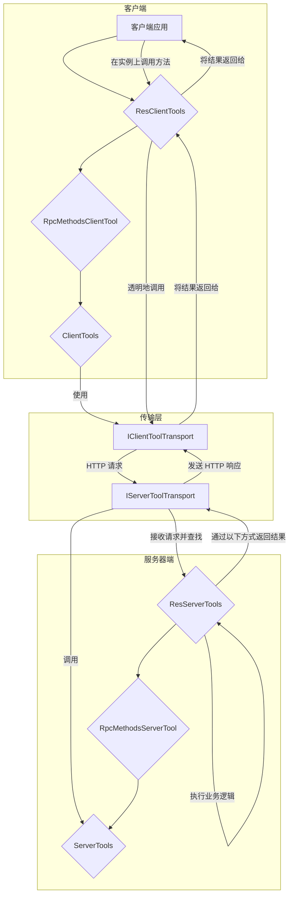

# @isdk/tool-rpc

`@isdk/tool-rpc` 是一个功能强大的 TypeScript 库，它将 `@isdk/tool-func` 的模块化能力从本地扩展到网络。通过它，您可以轻松地将 `ToolFunc` 作为远程服务暴露，并在客户端像调用本地函数一样无缝调用。它非常适合用于构建分布式 AI 代理、微服务架构或任何需要在不同进程或机器之间进行工具调用的场景。

本项目基于 `@isdk/tool-func` 构建。在继续之前，请确保您已熟悉其核心概念。

## ✨ 核心功能

- **分层抽象:** 提供了一套分层的工具类 (`ServerTools`, `RpcMethodsServerTool`, `ResServerTools`)，允许您根据需求选择合适的抽象级别。
- **🌐 RESTful 接口:** 使用 `ResServerTools` 快速创建符合 REST 风格的 API，自动处理 `get`, `list`, `post`, `put`, `delete` 等标准操作。
- **🔧 RPC 方法分组:** 使用 `RpcMethodsServerTool` 将多个相关函数（方法）捆绑在单个工具下，通过 `act` 参数进行调用。
- **🔌 客户端自动代理:** 客户端 (`ClientTools` 及其子类) 能从服务器自动加载工具定义，并动态生成类型安全的代理函数，使远程调用如本地调用般简单。
- **🚀 内置 HTTP 传输:** 提供基于 Node.js `http` 模块的 `HttpServerToolTransport` 和基于 `fetch` 的 `HttpClientToolTransport`，开箱即用。
- **🌊 支持流式响应:** 服务器和客户端均支持 `ReadableStream`，可轻松实现流式数据传输。

## 📦 安装

```bash
npm install @isdk/tool-rpc @isdk/tool-func
```

## 🚀 快速开始

以下示例演示了如何创建一个 RESTful 工具，在服务器上暴露它，并从客户端调用它。

### 第 1 步：定义服务器端工具

创建一个继承自 `ResServerTools` 的类。实现 `get`, `list` 等标准方法，以及任何以 `$` 为前缀的自定义业务逻辑方法。

```typescript
// ./tools/UserTool.ts
import { ResServerTools, ResServerFuncParams } from '@isdk/tool-rpc';
import { NotFoundError } from '@isdk/common-error';

// 用于演示的内存数据库
const users: Record<string, any> = {
  '1': { id: '1', name: '爱丽丝' },
  '2': { id: '2', name: '鲍勃' },
};

export class UserTool extends ResServerTools {
  // 标准 RESTful 方法：GET /api/users/:id
  get({ id }: ResServerFuncParams) {
    const user = users[id as string];
    if (!user) throw new NotFoundError(id as string, 'user');
    return user;
  }

  // 标准 RESTful 方法：GET /api/users
  list() {
    return Object.values(users);
  }

  // 自定义 RPC 方法
  $promote({ id }: ResServerFuncParams) {
    const user = users[id as string];
    if (!user) throw new NotFoundError(id as string, 'user');
    return { ...user, role: 'admin' };
  }
}
```

### 第 2 步：设置并启动服务器

在您的服务器入口文件中，实例化工具，然后设置并启动 `HttpServerToolTransport`。

```typescript
// ./server.ts
import { HttpServerToolTransport, ResServerTools } from '@isdk/tool-rpc';
import { UserTool } from './tools/UserTool';

async function startServer() {
  // 1. 实例化并注册您的工具。
  // 名称 'users' 将作为 URL 的一部分 (例如 /api/users)
  new UserTool('users').register();

  // 2. 初始化服务器传输层
  const serverTransport = new HttpServerToolTransport();

  // 3. 挂载工具的基类。传输层将找到所有已注册的 ResServerTools 实例。
  // 这将在 '/api' 前缀下创建 API 端点。
  serverTransport.mount(ResServerTools, '/api');

  // 4. 启动服务器
  const port = 3000;
  await serverTransport.start({ port });
  console.log(`✅ 工具服务器已启动，监听地址: http://localhost:${port}`);
}

startServer();
```

### 第 3 步：设置并使用客户端

在客户端代码中，初始化 `HttpClientToolTransport`，它会自动从服务器加载工具定义并创建代理。

```typescript
// ./client.ts
import { HttpClientToolTransport, ResClientTools } from '@isdk/tool-rpc';

// 定义一个类型以获得完整的类型提示，包括自定义方法
type UserClientTool = ResClientTools & {
  promote(params: { id: string }): Promise<{ id: string; name: string; role: string }>;
};

async function main() {
  const apiRoot = 'http://localhost:3000/api';

  // 1. 初始化客户端传输层
  const clientTransport = new HttpClientToolTransport(apiRoot);

  // 2. 挂载客户端工具。此操作将：
  //    a. 为 ResClientTools 设置传输层
  //    b. 从服务器加载 API 定义并创建代理工具
  await clientTransport.mount(ResClientTools);

  // 3. 获取为远程工具动态创建的代理
  const userTool = ResClientTools.get('users') as UserClientTool;
  if (!userTool) {
    throw new Error('远程工具 "users" 未找到！');
  }

  // 4. 像调用本地方法一样调用远程 API！

  // 调用 GET /api/users/1
  const user = await userTool.get!({ id: '1' });
  console.log('获取用户:', user); // { id: '1', name: '爱丽丝' }

  // 调用 GET /api/users
  const allUsers = await userTool.list!();
  console.log('所有用户:', allUsers); // [{...}, {...}]

  // 调用自定义 RPC 方法 $promote
  // 客户端代理会自动处理 `act` 参数
  const admin = await userTool.promote({ id: '2' });
  console.log('提升后的用户:', admin); // { id: '2', name: '鲍勃', role: 'admin' }
}

main();
```

## 核心概念：分层抽象

`@isdk/tool-rpc` 的核心设计思想是分层抽象，将网络通信与业务逻辑清晰分离。您可以根据需求的复杂度选择合适的抽象层级。



### 命名说明：`ServerTools` (复数) vs. 实例 (单数)

您可能会注意到类名 `ServerTools`、`ClientTools` 等是复数形式。这是一个刻意的设计，反映了其双重角色：

- **静态类作为注册表 (The Plural 'Tools')**: `ServerTools` 的静态部分（例如 `ServerTools.register()`, `ServerTools.items`）充当所有远程工具的**全局注册表和管理器**。它持有一个工具集合，并提供管理这些工具的静态方法。这就是名称中“Tools”（复数）的由来。

- **实例作为单个工具 (The Singular 'Tool')**: 当您创建一个实例时（例如 `new ServerTools({ name: 'myTool', ... })`），您实际上是在定义一个**单一的、具体的工具**。这个实例封装了单个函数的逻辑、元数据和配置。

简而言之：**类是工具的集合，实例是单个工具。** 这种设计将工具的管理（静态）与工具的定义（实例）清晰地分离开来。

### 第 1 层：`ServerTools` / `ClientTools` - 基础远程函数

这是最基础的层，代表一个单一的、可远程调用的函数。

- **`ServerTools`**:
  - **概念**: 一个独立的、可被远程执行的函数。
  - **用途**: 当您只需要暴露一些零散、无太多关联的函数时，这是最简单的方式。
  - **高级用法**: 在 `func` 中，可以通过 `params._req` 和 `params._res` 访问原始的 HTTP 请求和响应对象，以便进行更底层的控制。
  - **示例**:

    ```typescript
    // server.ts
    new ServerTools({
      name: 'ping',
      isApi: true, // 标记为可被发现
      func: () => 'pong',
    }).register();
    ```

- **`ClientTools`**:
  - **概念**: 服务器上 `ServerTools` 的客户端代理。
  - **工作原理**: `client.init()` 后，它会创建一个名为 `ping` 的 `ClientTools` 实例。当您调用 `ToolFunc.run('ping')` 时，它会通过网络将请求发送到服务器。

### 第 2 层：`RpcMethodsServerTool` / `RpcMethodsClientTool` - 面向对象的服务

这一层将多个相关的函数组织成一个类似“对象”或“服务”的集合。

- **`RpcMethodsServerTool`**:
  - **概念**: 一个包含多个可调用方法的“服务”对象。它充当一个分发器。
  - **用途**: 当您有一组功能内聚的操作时（例如，一个 `UserService` 包含 `createUser`, `updateUser`, `getUser`），使用此类可以更好地组织代码。
  - **工作原理**: 在类中，以 `$` 为前缀定义的方法（如 `$createUser`）会被自动注册为 RPC 方法。客户端通过在请求中传递 `act: '$createUser'` 参数来指定调用哪个方法。
  - **示例**:

    ```typescript
    // server.ts
    class UserService extends RpcMethodsServerTool {
      $createUser({ name }) {
        // ... 创建用户的逻辑
        return { id: 'user-1', name };
      }
      $getUser({ id }) {
        // ... 获取用户的逻辑
        return { id, name: 'Test User' };
      }
    }
    new UserService('userService').register();
    ```

- **`RpcMethodsClientTool`**:
  - **概念**: 远程服务对象的客户端代理。
  - **工作原理**: 初始化时，它会检测到服务器上的 `$createUser` 和 `$getUser` 方法，并在客户端实例上动态创建对应的 `createUser()` 和 `getUser()` 方法。这使得调用看起来就像在调用一个本地对象的方法，完全隐藏了底层的 `act` 参数和网络通信。
  - **示例**:

    ```typescript
    // client.ts
    const userService = RpcMethodsClientTool.get('userService');
    const newUser = await userService.createUser({ name: 'Alice' });
    ```

### 第 3 层：`ResServerTools` / `ResClientTools` - RESTful 资源

这是最高级的抽象，它在 RPC 的基础上提供了一个以资源为中心的 RESTful 风格 API。

- **`ResServerTools`**:
  - **概念**: 代表一个 RESTful 资源，内置了对标准 HTTP 动词（GET, POST, PUT, DELETE）的映射。
  - **用途**: 用于需要提供标准 CRUD（创建、读取、更新、删除）操作的场景，例如管理 `users` 或 `products` 资源。
  - **工作原理**: 它继承自 `RpcMethodsServerTool`，并预定义了 `get`, `list`, `post`, `put`, `delete` 等特殊方法。HTTP 传输层会根据请求的 `method` (GET/POST) 和 URL 中是否包含 `id` 来智能地调用相应的方法。
    - `GET /users/:id` -> `get({ id })`
    - `GET /users` -> `list()`
    - `POST /users` -> `post({ val })`
  - **高级用法**: 由于它继承自 `RpcMethodsServerTool`，您仍然可以在 `ResServerTools` 的子类中定义自定义的 `$` 方法，从而将 RESTful 风格与特定的 RPC 调用结合起来（如此页的快速入门示例所示）。

- **`ResClientTools`**:
  - **概念**: 远程 RESTful 资源的客户端代理。
  - **工作原理**: 它提供了一组便捷的方法，如 `.get()`, `.list()`, `.post()` 等，这些方法会自动构造并发送符合 REST 语义的请求。
  - **示例**:

    ```typescript
    // client.ts
    const userRes = ResClientTools.get('users');
    const user = await userRes.get({ id: '1' }); // 发送 GET /api/users/1
    const allUsers = await userRes.list();       // 发送 GET /api/users
    ```

## 🔌 传输层 (Transport Layer)

传输层是 `@isdk/tool-rpc` 的核心支柱，它充当服务器工具和客户端工具之间的通信桥梁，实现了真正的远程过程调用（RPC）。

### 设计思想

传输层的核心设计思想是**关注点分离**。它将工具的业务逻辑（您在 `Tool` 中定义的）与网络通信的实现细节（如协议、路由、序列化）完全解耦。这使得您的工具代码保持纯粹和可移植，无需关心它是通过 HTTP、WebSockets 还是其他任何协议进行通信。您只需定义工具的功能，传输层会处理好剩下的事情。

### 核心抽象

该架构围绕几个关键接口构建：

- **`IToolTransport`**: 所有传输的通用基础接口，定义了 `mount`（挂载）等基本操作。
- **`IServerToolTransport`**: 服务器端传输必须实现的接口。其核心职责是：
    1. **暴露发现端点**: 创建一个通常为 `GET` 的路由（例如 `/api`），当客户端访问时，它会返回所有已注册并可用的工具的 JSON 定义。这是通过 `addDiscoveryHandler` 方法实现的。
    2. **处理 RPC 调用**: 创建一个通用的 RPC 路由（例如 `/api/:toolId`），它接收请求，根据 `toolId` 查找对应的工具，执行它，然后返回结果。这是通过 `addRpcHandler` 方法实现的。
    3. 管理服务器生命周期 (`start`, `stop`)。
- **`IClientToolTransport`**: 客户端传输必须实现的接口。其核心职责是：
    1. **加载 API 定义**: 调用 `loadApis()` 方法，该方法会访问服务器的发现端点以获取所有工具的定义。
    2. **执行远程调用**: 实现 `fetch()` 方法，该方法负责将客户端的工具调用（函数名和参数）序列化，发送到服务器的 RPC 端点，并处理响应。

### 内置 HTTP 传输

本库提供了一套即插即用的、基于 HTTP 的传输实现，无需额外配置：

- **`HttpServerToolTransport`**: 一个服务器端传输，使用 Node.js 内置的 `http` 模块来创建一个轻量级的服务器。当您调用 `serverTransport.mount(ServerTools, '/api')` 时，它会自动：
  - 创建一个 `GET /api` 路由用于服务发现。
  - 创建一个 `POST /api/:toolId` 路由（也支持其他方法）来处理所有工具的 RPC 调用。它会智能地从请求体或 URL 参数中解析出工具的参数。

- **`HttpClientToolTransport`**: 一个客户端传输，使用跨平台的 `fetch` API 来向服务器发送请求。当您调用 `client.init()`（内部使用 `loadApis`）时，它会请求 `GET /api`。当您运行一个工具时，它会向 `POST /api/toolName` 发送一个包含参数的 JSON 请求。

### 功能扩展：创建您自己的传输

`@isdk/tool-rpc` 的设计是完全可扩展的。您可以通过实现上述接口来创建自己的传输层，以支持不同的协议（如 WebSockets, gRPC）或集成到现有的 Web 框架（如 Express, Koa, Fastify）中。

**集成 Fastify 框架的思路**：

1. 创建一个 `FastifyServerTransport` 类并实现 `IServerToolTransport`。
2. 在 `mount` 方法中，您不再创建新的 `http` 服务器，而是接收一个现有的 `FastifyInstance` 作为选项。
3. 使用 `fastify.get(apiPrefix, ...)` 来注册发现路由，其处理器调用 `ServerTools.toJSON()`。
4. 使用 `fastify.all(apiPrefix + '/:toolId', ...)` 来注册 RPC 路由，其处理器从 `request.body` 或 `request.query` 中提取参数，调用相应的工具，然后使用 `reply` 发送响应。
5. `start` 和 `stop` 方法可以委托给 Fastify 实例的 `listen` 和 `close`。

这种可插拔的架构为 `@isdk/tool-rpc` 提供了极大的灵活性，使其能够轻松适应各种项目需求和技术栈。

## 高级用法

本节涵盖了 `@isdk/tool-rpc` 中一些更强大的功能，可用于构建灵活高效的应用程序。

### 导出函数以在客户端执行

在某些场景下，您可能希望将计算从服务器卸载或允许客户端在本地执行函数。`allowExportFunc` 选项通过序列化函数体并在发现阶段将其发送到客户端来实现这一点。当该选项设置为 `true` 时，客户端的 `ClientTools` 将自动使用这个下载的函数，而不是发起网络请求。

**服务器端配置:**

```typescript
// server.ts
new ServerTools({
  name: 'local-uuid',
  isApi: true,
  allowExportFunc: true, // 允许此函数被下载
  func: () => {
    // 这段逻辑将在客户端执行
    console.log('正在客户端生成 UUID...');
    return Math.random().toString(36).substring(2, 15);
  },
}).register();
```

**客户端用法:**

```typescript
// client.ts
const uuidTool = ClientTools.get('local-uuid');
// 此调用将执行下载的函数体，不会发起网络请求。
const uuid = await uuidTool.run();
console.log('生成的 UUID:', uuid);
```

### 自动 RESTful 方法路由

当使用 `ResServerTools` 时，框架会智能地路由传入的 HTTP 请求。它会检查 HTTP 方法和 `id` 参数是否存在，以确定调用哪个函数。这个逻辑由工具内部的 `getMethodFromParams` 处理，提供了以下开箱即用的映射：

- `GET /api/my-resource` → `list()`
- `GET /api/my-resource/123` → `get({ id: '123' })`
- `POST /api/my-resource` → `post({ val: ... })`

这使您能够编写干净、面向资源的代码，而无需担心手动路由。

### 混合 RESTful 和 RPC 工具

由于 `ResServerTools` 继承自 `RpcMethodsServerTool`，您可以在单个工具中结合两种 API 风格。您可以实现标准的 RESTful 方法（`get`, `list`），同时添加自定义的 RPC 风格方法（例如 `$archive`, `$publish`）来处理不符合 CRUD 模型的特定业务操作。

### 自动参数类型转换

您在工具上定义的 `params` 模式不仅仅用于文档。服务器会自动使用它来将传入的参数转换为其指定的类型。例如，如果您定义 `id: { type: 'number' }`，任何从 URL 路径（这是一个字符串）接收到的 `id` 将在调用您的函数之前被转换为 `Number`。

### 客户端方法别名

为了方便起见，当您在服务器上用 `$` 前缀定义一个方法时（例如 `$promoteUser`），客户端代理会自动创建一个不带前缀的更清晰的别名。这允许您在客户端上调用 `myTool.promoteUser(...)`，使代码更具可读性和惯用性。

## 🤝 贡献

我们欢迎各种形式的贡献！请阅读 [CONTRIBUTING.md](./CONTRIBUTING.md) 文件以获取有关如何开始的指南。

## 📄 许可证

该项目根据 MIT 许可证授权。有关更多详细信息，请参阅 [LICENSE-MIT](./LICENSE-MIT) 文件。
