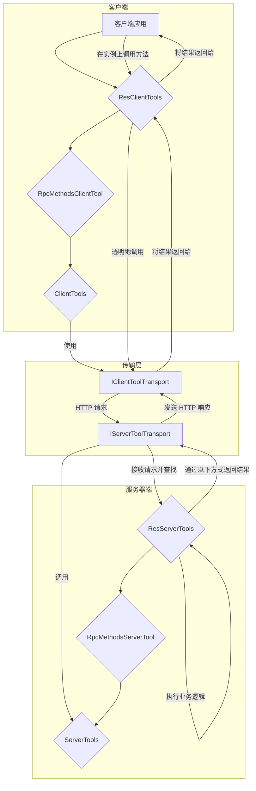

# @isdk/tool-rpc

`@isdk/tool-rpc` 是一个功能强大的 TypeScript 库，它将 `@isdk/tool-func` 的模块化能力从本地扩展到网络。通过它，您可以轻松地将 `ToolFunc` 作为远程服务暴露，并在客户端像调用本地函数一样无缝调用。它非常适合用于构建分布式 AI 代理、微服务架构或任何需要在不同进程或机器之间进行工具调用的场景。

本项目基于 `@isdk/tool-func` 构建。在继续之前，请确保您已熟悉其核心概念。

## ✨ 核心功能

- **三位一体架构 (V2.6+):** 
  - **RpcTransportManager (管理中心)**: 协议注册中心、逻辑路由审计及传输实例生命周期管理。
  - **RpcServerDispatcher (执行调度器)**: 独立于协议的执行引擎，内置并发隔离（影子实例）与任务追踪。
  - **RpcActiveTaskTracker (任务追踪器)**: 跨协议任务可见性，支持结果保留策略与后台执行 (102 Processing)。
- **分层抽象:** 提供了一套分层的工具类 (`ServerTools`, `RpcMethodsServerTool`, `ResServerTools`)，允许您根据需求选择合适的抽象级别。
- **🌐 RESTful 接口:** 使用 `ResServerTools` 快速创建符合 REST 风格的 API，自动处理 `get`, `list`, `post`, `put`, `delete` 等标准操作。
- **🔧 RPC 方法分组:** 使用 `RpcMethodsServerTool` 将多个相关函数（方法）捆绑在单个工具下，通过 `act` 参数进行调用。
- **🔌 客户端自动代理:** 客户端 (`ClientTools` 及其子类) 能从服务器自动加载工具定义，并动态生成类型安全的代理函数。
- **🚀 多实例并行隔离:** 支持在单个进程中运行多个具有不同 `apiUrl` 的传输实例，彻底消除全局状态冲突。
- **🛡️ 执行死线守卫:** 集成两级超时管理（软/硬死线）以及物理链路与逻辑执行的中止联动。
- **🚀 内置 HTTP & Mailbox 传输:** 
  - **HTTP**: 提供基于 Node.js `http` 模块的服务器和基于 `fetch` 的客户端。
  - **Mailbox**: 原生支持内部分布式信箱协议，适用于跨进程或跨线程通信。
- **🌊 深度流式支持:** 服务器和客户端均支持 `ReadableStream` (Web & Node)，具备完整的生命周期管理、背压控制及自动清理机制。

## 📦 安装

```bash
npm install @isdk/tool-rpc @isdk/tool-func
```

## 🚀 快速开始

以下示例演示了如何创建一个 RESTful 工具，在服务器上暴露它，并从客户端调用它。

### 第 1 步：定义服务器端工具

创建一个继承自 `ResServerTools` 的类。实现 `get`, `list` 等标准方法，以及任何以 `$` 为前缀的自定义业务逻辑方法。

```typescript
// ./tools/UserTool.ts
import { ResServerTools, ResServerFuncParams } from '@isdk/tool-rpc';
import { NotFoundError } from '@isdk/common-error';

// 用于演示的内存数据库
const users: Record<string, any> = {
  '1': { id: '1', name: '爱丽丝' },
  '2': { id: '2', name: '鲍勃' },
};

export class UserTool extends ResServerTools {
  // 标准 RESTful 方法：GET /api/users/:id
  get({ id }: ResServerFuncParams) {
    const user = users[id as string];
    if (!user) throw new NotFoundError(id as string, 'user');
    return user;
  }

  // 标准 RESTful 方法：GET /api/users
  list() {
    return Object.values(users);
  }

  // 自定义 RPC 方法
  $promote({ id }: ResServerFuncParams) {
    const user = users[id as string];
    if (!user) throw new NotFoundError(id as string, 'user');
    return { ...user, role: 'admin' };
  }
}
```

### 第 2 步：设置并启动服务器

在 V2 中，我们建议使用 `RpcTransportManager` 进行生命周期管理，并显式配置 `RpcServerDispatcher`。

```typescript
// ./server.ts
import { HttpServerToolTransport, RpcTransportManager, RpcServerDispatcher, ServerTools } from '@isdk/tool-rpc';
import { UserTool } from './tools/UserTool';

async function startServer() {
  // 1. 在全局注册表中注册工具实例
  new UserTool('users').register();

  // 2. 初始化传输层并注入专用的调度器
  const apiUrl = 'http://localhost:3000/api';
  const serverTransport = new HttpServerToolTransport({
    apiUrl,
    dispatcher: new RpcServerDispatcher({ registry: ServerTools.items })
  });

  // 3. 配置该传输层的逻辑路由
  // 暴露工具定义供客户端发现
  serverTransport.addDiscoveryHandler(apiUrl, () => ServerTools.toJSON());
  // 暴露 RPC 端点供工具执行
  serverTransport.addRpcHandler(apiUrl);

  // 4. 将传输层注册到管理器并启动所有服务
  RpcTransportManager.instance.addServer(serverTransport);
  await RpcTransportManager.instance.startAll();

  console.log(`✅ 工具服务器已启动，地址: ${apiUrl}`);
}

startServer();
```

### 第 3 步：设置并使用客户端

在 V2 中，客户端 (`ResClientTools.loadFrom`) 使用 `RpcTransportManager` 根据 `apiUrl` 自动解析并管理传输实例。

```typescript
// ./client.ts
import { HttpClientToolTransport, RpcTransportManager, ResClientTools } from '@isdk/tool-rpc';

// 定义一个类型以获得完整的类型提示，包括自定义方法
type UserClientTool = ResClientTools & {
  promote(params: { id: string }): Promise<{ id: string; name: string; role: string }>;
};

async function main() {
  const apiUrl = 'http://localhost:3000/api';

  // 1. 注册 HTTP 协议（如果未全局预注册）
  RpcTransportManager.bindScheme('http', HttpClientToolTransport);

  // 2. 从服务器加载 API 定义
  // 这会自动为给定的 apiUrl 创建或使用传输实例
  await ResClientTools.loadFrom(undefined, { apiUrl });

  // 3. 获取为远程工具动态创建的代理
  const userTool = ResClientTools.get('users') as UserClientTool;
  if (!userTool) {
    throw new Error('远程工具 "users" 未找到！');
  }

  // 4. 像调用本地方法一样调用远程 API！

  // 调用 GET /api/users/1
  const user = await userTool.get!({ id: '1' });
  console.log('获取用户:', user); // { id: '1', name: '爱丽丝' }

  // 调用 GET /api/users
  const allUsers = await userTool.list!();
  console.log('所有用户:', allUsers); // [{...}, {...}]

  // 调用自定义 RPC 方法 $promote
  const admin = await userTool.promote({ id: '2' });
  console.log('提升后的用户:', admin); // { id: '2', name: '鲍勃', role: 'admin' }
}

main();
```

### 核心概念：分层抽象

`@isdk/tool-rpc` 的核心设计思想是分层抽象，将网络通信与业务逻辑清晰分离。您可以根据需求的复杂度选择合适的抽象层级。

## 🏛️ 深度架构：容器、业务与隔离

`@isdk/tool-rpc` 的架构设计基于一个核心哲学：**静态类作为容器，实例作为业务函数。** 这种设计平衡了全局工具管理与具体业务逻辑的实现。

### 1. 双重身份模型 (The Duality)

* **容器类 (Plural 'Tools')**：如 `ServerTools`, `RpcMethodsServerTool`, `ResServerTools`。
  * **角色**：它们是静态的**注册表 (Registry)** 和 **发现协议过滤器**。
  * **职责**：定义层级规范，管理工具集合，实现 `toJSON()` 发现算法。在代码层面上，它们通过静态属性（如 `items`）维护全局状态。
* **业务实例 (Singular 'Tool'/'Func')**：由 `new ServerTools(...)` 或其子类创建的实例。
  * **角色**：它们是具体的**功能实现单元 (Functional Unit)**。
  * **职责**：承载业务逻辑（通过 `func` 方法或以 `$` 开头的 RPC 方法），定义具体的参数模式 (`params`) 和元数据。

> **命名约定**：类名使用复数（Tools）表示其容器属性，实例或其派生业务类逻辑上视为单数（Tool/Func）。

### 2. 发现隔离与层级兼容 (Discovery Isolation)

为了确保客户端在自动发现（Discovery）阶段加载到的是精准且协议匹配的工具定义，项目实现了一套**基于层级的发现隔离机制**。

* **隔离算法**：`toJSON()` 方法在遍历注册表时，会执行三重校验：
    1. **类型检查**：`item instanceof this` 确保工具属于当前层级或其子层级。
    2. **协议引用检查**：校验 `item.constructor.toJSON === this.toJSON`。这确保了如果一个子类（如 `RpcMethodsServerTool`）为了实现更复杂的协议而重写了 `toJSON`，那么它的实例将不会被父类（如 `ServerTools`）导出，从而避免基础客户端加载到无法处理的复杂工具。
    3. **显示标记检查**：`item.isApi !== false`。

* **各层级导出范围**：
  * **`ServerTools.toJSON()`**：仅导出直接属于 `ServerTools` 的实例，以及标记为 `isApi: true` 的基础 `ToolFunc`。它**绝对不会**导出 RPC 或 Resource 类型的工具。
  * **`RpcMethodsServerTool.toJSON()`**：导出所有 RPC 类型的工具。由于层级向下兼容，它**包含**其子类 `ResServerTools` 的实例。
  * **`ResServerTools.toJSON()`**：实现向上隔离，仅导出 Resource 类型的工具，不包含父类 `RpcMethodsServerTool` 的通用 RPC 方法。

* **`isApi` 的默认行为准则**：
  * **对于派生自 `ServerTools` 的业务类实例**：由于其设计初衷就是为了远程暴露，因此默认**自动导出**。除非开发者显式设置 `isApi: false` 来实现“包内可见”逻辑。
  * **对于基础 `ToolFunc` 实例**：出于安全考虑，默认**禁止导出**。必须显式设置 `isApi: true` 才能被 `ServerTools` 容器发现。


```mermaid
graph TD
    subgraph 客户端
        A[客户端应用] --> B{ResClientTools};
        B --> C{RpcMethodsClientTool};
        C --> D{ClientTools};
    end
    subgraph 传输层
        D --> |使用| E[IClientToolTransport];
        E -- HTTP 请求 --> F[IServerToolTransport];
    end
    subgraph 服务器端
        F -->|调用| G{ServerTools};
        H{ResServerTools} --> I{RpcMethodsServerTool};
        I --> G;
    end

    A -- 在实例上调用方法 --> B;
    B -- 透明地调用 --> E;
    F -- 接收请求并查找 --> H;
    H -- 执行业务逻辑 --> H;
    H -- 通过以下方式返回结果 --> F;
    F -- 发送 HTTP 响应 --> E;
    E -- 将结果返回给 --> B;
    B -- 将结果返回给 --> A;
```

### 3. 🛡️ 并发隔离 (影子实例 Shadow Instances)

V2 架构引入了**影子实例**机制，彻底解决了异步环境下的 `this.ctx` 竞态冲突。
- 当请求到达时，`Dispatcher` 会利用 `Object.create(tool)` 创建一个新实例。
- **属性遮蔽 (Property Shadowing)**：`this.ctx = context` 仅作用于当前执行实例，确保高并发下的物理隔离，同时保留对原始工具属性的访问。

### 4. 🚀 三位一体架构 (V2.6+)

`@isdk/tool-rpc` 的核心由三个解耦的组件构成：

1.  **RpcTransportManager (管理中心)**:
    - **物理映射**: 管理 `apiUrl` 到 `IToolTransport` 实例的映射。
    - **路由审计**: 执行 `ListenAddr -> Set<RoutePath>` 冲突检测，防止在共享物理端口上发生路由劫持。
2.  **RpcServerDispatcher (执行调度器)**:
    - **归一化**: 将协议特定的对象转化为标准的 `ToolRpcContext`。
    - **死线裁决**: 实现软死线（触发 `102 Processing` 以转入后台执行）和硬死线（以 `408` 终止任务）。
3.  **RpcActiveTaskTracker (任务账本)**:
    - **可观测性**: 跨协议追踪所有活跃和后台任务。
    - **结果保留**: 管理任务结果的保留策略（`Once`, `Permanent`, TTL）。
    - **中止联动**: 将物理连接的 `AbortSignal` 桥接到执行层。

## 🛠️ 进阶架构：分层注册表与多态定制

在构建复杂的 AI 代理平台、多租户 SaaS 系统或插件化架构时，你可能需要一套“标准工具集”，并允许不同的租户或插件对其进行个性化微调。`@isdk/tool-rpc` 利用底层 `tool-func` 的**分层注册表 (Hierarchical Registries)** 完美支持了这一需求。

### 1. 隔离与继承 (Registry Isolation)

通过调用 `Tools.isolateRegistry()`，你可以从父级容器分支处一个新的作用域。这个作用域利用 JavaScript 原型链实现了“写时拷贝”的效果：

- **继承性**：子容器可以访问父容器中的所有工具。
- **局部性**：在子容器中注册的新工具仅在当前作用域（及其后代）可见，不会污染父容器。
- **业务场景**：为不同的 AI 代理组分配独立的工具域，或在单元测试中隔离 Server 和 Client 的注册表。

### 2. 工具影子遮蔽 (Shadowing & Polymorphism)

你可以在隔离的容器中注册一个与父级同名的工具。这会在当前作用域内产生一个“影子（Shadow）”：

- **多态表现**：在当前容器的上下文中，该名称将指向新的实现；而在父容器的上下文中，该名称依然指向原始实现。
- **业务场景**：在不修改基础框架代码的前提下，允许特定插件替换标准工作流中的某个具体原子工具（如更换通知方式从 Email 到 Slack）。

### 3. 智能依赖绑定策略 (Smart Binding)

当一个复杂的“工作流工具”通过 `depends` 属性依赖其他工具时，如何解析这些依赖项决定了系统的灵活性与稳定性。`tool-rpc` 提供了三种绑定策略：

* **`'auto'` (默认 - 智能感知)**：**最符合直觉的业务模式**。
  - **逻辑**：系统会智能判断“调用者”与“工具定义者”的关系。只有当调用者属于定义者的“后代作用域”时，才会尝试寻找影子遮蔽版本。
  - **意义**：它实现了“局部定制，全局稳定”。它允许插件修改工作流的某个中间环节，而不会破坏父级系统自身的稳定性保护。
* **`'early'` (早绑定 - 契约保护模式)**：
  - **逻辑**：始终使用注册时锁定的原始依赖实例。
  - **意义**：用于安全性或一致性要求极高的核心依赖（如加解密、鉴权、底层存储），防止其被下游影子覆盖所“劫持”。
* **`'late'` (晚绑定 - 运行环境优先)**：
  - **逻辑**：无视血缘关系，强制从当前最顶层的容器解析依赖。
  - **意义**：允许完全的运行时注入，适用于需要根据执行环境彻底切换逻辑的场景。

### 4. 命名空间保护 (Protection)

为了防止意外的影子遮蔽，可以在注册时使用 `allowOverride: false`。注册表将递归检查整个原型链，如果名称已被占用（包括在父级中），则会抛出错误，从而保护核心 API 不被覆盖。

## ⚠️ 常见误区与坑点 (Common Pitfalls)

1. **误区：在 `ResServerTools` 子类中定义 `func()`**
    * **后果**：`ResServerTools` 依赖 `func` 来进行 REST/RPC 分发。如果你手动重写了 `func` 且未调用 `super.func`，所有的 `get/list/$method` 调用都将失效。
    * **正确做法**：在 Res 层级，应始终通过定义 `get()`, `list()` 或以 `$` 为前缀的方法来实现业务。

2. **误区：认为 `isApi: false` 是防火墙**
    * **后果**：`isApi: false` 目前仅在“发现”阶段起作用（即客户端看不到它）。如果攻击者猜到了工具名称并直接构造请求，服务器传输层默认仍会执行它。
    * **正确做法**：对于敏感工具，应在业务逻辑内接入鉴权机制，或利用 `_req` 上下文进行权限校验。

3. **误区：单进程测试时未做隔离**
    * **后果**：报错 `[ToolName] already registered as ServerTools`。
    * **正确做法**：在 `beforeAll` 钩子中为 `ClientTools` 开启 `isolateRegistry()`。

4. **误区：混淆静态 Tools 与 实例 Func 的职责**
    * **后果**：在业务逻辑中尝试修改 `ServerTools.items`，导致全局污染。
    * **正确做法**：静态成员仅用于管理和配置，业务逻辑应严格限定在实例的 `this` 或 `this.ctx` 上。

## ⏱️ 超时机制 (Timeout Strategy)

`@isdk/tool-rpc` 特别针对分布式 AI 代理场景优化了超时控制，遵循“最小超时原则”。

### 1. 配置格式

`timeout` 属性支持简写和详写：

- **简写 (number)**: 毫秒数，代表硬超时时间。
- **详写 (Object)**:
  - `value`: 硬超时时长。
  - `streamIdleTimeout`: 流式传输的空闲超时（首字节或数据块间隔）。
  - `keepAliveOnTimeout`: 默认为 `false`。若设为 `true`，服务端在返回超时错误后会允许任务在后台继续运行。

### 2. 预估耗时 (expectedDuration)

这是一个 UX 友好型指标（非强制约束）。客户端可以利用它优化加载体验：

- **UI 模拟进度**: 在 `expectedDuration` 期间平滑移动进度条。
- **智能重试**: 若超过预期耗时且任务幂等，客户端可选择发起并发冗余请求。

## 🧠 执行上下文 (Context) 与 影子实例

为了确保并发安全并解耦业务逻辑与环境信息，项目采用了“原型链影子实例”机制。

### 1. this.ctx 访问

在工具内部，请通过 `this.ctx` 访问执行环境信息，而不是将环境参数混入业务 `params`：

- `this.ctx.signal`: 自动注入的 `AbortSignal`。
- `this.ctx._req` / `this.ctx._res`: 原始传输层请求/响应对象。
- 自定义字段: 如 `traceId` 或 `userId`。

### 2. .with(ctx) 链式调用

客户端可以通过 `.with()` 为单次或一系列调用预设环境：

```typescript
const runner = tool.with({ timeout: 2000, traceId: 'T123' });
await runner.run(params);
```

### 第 1 层：`ServerTools` / `ClientTools` - 基础远程函数

这是最基础的层，代表一个单一的、可远程调用的函数。

- **`ServerTools`**:
  - **概念**: 一个独立的、可被远程执行的函数。
  - **用途**: 当您只需要暴露一些零散、无太多关联的函数时，这是最简单的方式。
  - **高级用法**: 在 `func` 中，可以通过 `params._req` 和 `params._res` 访问原始的 HTTP 请求和响应对象，以便进行更底层的控制。
  - **示例**:

    ```typescript
    // server.ts
    new ServerTools({
      name: 'ping',
      isApi: true, // 标记为可被发现
      func: () => 'pong',
    }).register();
    ```

- **`ClientTools`**:
  - **概念**: 服务器上 `ServerTools` 的客户端代理。
  - **工作原理**: `client.init()` 后，它会创建一个名为 `ping` 的 `ClientTools` 实例。当您调用 `ToolFunc.run('ping')` 时，它会通过网络将请求发送到服务器。

### 第 2 层：`RpcMethodsServerTool` / `RpcMethodsClientTool` - 面向对象的服务

这一层将多个相关的函数组织成一个类似“对象”或“服务”的集合。继承自上一层的 `ServerTools`。

- **`RpcMethodsServerTool`**:
  - **概念**: 一个包含多个可调用方法的“服务”对象。它充当一个分发器。
  - **用途**: 当您有一组功能内聚的操作时（例如，一个 `UserService` 包含 `createUser`, `updateUser`, `getUser`），使用此类可以更好地组织代码。
  - **工作原理**: 在类中，以 `$` 为前缀定义的方法（如 `$createUser`）会被自动注册为 RPC 方法。客户端通过在请求中传递 `act: '$createUser'` 参数来指定调用哪个方法。
  - **示例**:

    ```typescript
    // server.ts
    class UserService extends RpcMethodsServerTool {
      $createUser({ name }) {
        // ... 创建用户的逻辑
        return { id: 'user-1', name };
      }
      $getUser({ id }) {
        // ... 获取用户的逻辑
        return { id, name: 'Test User' };
      }
    }
    new UserService('userService').register();
    ```

- **`RpcMethodsClientTool`**:
  - **概念**: 远程服务对象的客户端代理。
  - **工作原理**: 初始化时，它会检测到服务器上的 `$createUser` 和 `$getUser` 方法，并在客户端实例上动态创建对应的 `createUser()` 和 `getUser()` 方法。这使得调用看起来就像在调用一个本地对象的方法，完全隐藏了底层的 `act` 参数和网络通信。
  - **示例**:

    ```typescript
    // client.ts
    const userService = RpcMethodsClientTool.get('userService');
    const newUser = await userService.createUser({ name: 'Alice' });
    ```

### 第 3 层：`ResServerTools` / `ResClientTools` - RESTful 资源

这是最高级的抽象，它在 RPC 的基础上提供了一个以资源为中心的 RESTful 风格 API。继承自 `RpcMethodsServerTool`。

- **`ResServerTools`**:
  - **概念**: 代表一个 RESTful 资源，内置了对标准 HTTP 动词（GET, POST, PUT, DELETE）的映射。
  - **用途**: 用于需要提供标准 CRUD（创建、读取、更新、删除）操作的场景，例如管理 `users` 或 `products` 资源。
  - **工作原理**: 它继承自 `RpcMethodsServerTool`，并预定义了 `get`, `list`, `post`, `put`, `delete` 等特殊方法。HTTP 传输层会根据请求的 `method` (GET/POST) 和 URL 中是否包含 `id` 来智能地调用相应的方法。
    - `GET /users/:id` -> `get({ id })`
    - `GET /users` -> `list()`
    - `POST /users` -> `post({ val })`
  - **高级用法**: 由于它继承自 `RpcMethodsServerTool`，您仍然可以在 `ResServerTools` 的子类中定义自定义的 `$` 方法，从而将 RESTful 风格与特定的 RPC 调用结合起来（如此页的快速入门示例所示）。

- **`ResClientTools`**:
  - **概念**: 远程 RESTful 资源的客户端代理。
  - **工作原理**: 它提供了一组便捷的方法，如 `.get()`, `.list()`, `.post()` 等，这些方法会自动构造并发送符合 REST 语义的请求。
  - **示例**:

    ```typescript
    // client.ts
    const userRes = ResClientTools.get('users');
    const user = await userRes.get({ id: '1' }); // 发送 GET /api/users/1
    const allUsers = await userRes.list();       // 发送 GET /api/users
    ```

## 🔌 传输层 (Transport Layer)

传输层是 `@isdk/tool-rpc` 的核心支柱，它充当服务器工具和客户端工具之间的通信桥梁，实现了真正的远程过程调用（RPC）。

### 设计思想

传输层的核心设计思想是**关注点分离**。它将工具的业务逻辑（您在 `Tool` 中定义的）与网络通信的实现细节（如协议、路由、序列化）完全解耦。这使得您的工具代码保持纯粹和可移植，无需关心它是通过 HTTP、WebSockets 还是其他任何协议进行通信。您只需定义工具的功能，传输层会处理好剩下的事情。

### 核心抽象

该架构围绕几个关键接口构建：

- **`IToolTransport`**: 所有传输的通用基础接口，定义了 `mount`（挂载）等基本操作。
- **`IServerToolTransport`**: 服务器端传输必须实现的接口。其核心职责是：
    1. **暴露发现端点**: 创建一个通常为 `GET` 的路由（例如 `/api`），当客户端访问时，它会返回所有已注册并可用的工具的 JSON 定义。这是通过 `addDiscoveryHandler` 方法实现的。
    2. **处理 RPC 调用**: 创建一个通用的 RPC 路由（例如 `/api/:toolId`），它接收请求，根据 `toolId` 查找对应的工具，执行它，然后返回结果。这是通过 `addRpcHandler` 方法实现的。
    3. 管理服务器生命周期 (`start`, `stop`)。
    4. **物理感知 (V2)**: 通过 `getListenAddr()` 和 `getRoutes()` 实现物理端口复用与逻辑路由审计。
- **`IClientToolTransport`**: 客户端传输必须实现的接口。其核心职责是：
    1. **加载 API 定义**: 调用 `loadApis()` 方法，该方法会访问服务器的发现端点以获取所有工具的定义。
    2. **执行远程调用**: 实现 `fetch()` 方法，该方法负责将客户端的工具调用（函数名和参数）序列化，发送到服务器的 RPC 端点，并处理响应。
    3. **后台生命周期 (V2)**: 支持 **102 Processing 轮询** 以及与本地 `AbortSignal` 联动的远程中止。

### 内置传输实现

本库提供了多套即插即用的传输实现，无需额外配置：

- **`HttpServerToolTransport` (HTTP 服务端)**: 基于 Node.js 内置 `http` 模块。在 V2 中，它支持 **最长前缀匹配 (Longest Prefix Match)** 路由，允许多个逻辑实例共享同一个物理端口（物理底座复用）。它会自动：
  - 创建一个 `GET /prefix` 路由用于服务发现。
  - 创建一个包含工具名的 RPC 路由，智能解析请求体或 URL 参数。

- **`HttpClientToolTransport` (HTTP 客户端)**: 基于跨平台 `fetch` API。V2 版本支持对后台任务的自动状态轮询。

- **`Mailbox Transports` (信箱传输)**: 原生支持内部分布式信箱协议。
  - **特点**: 适用于跨进程或跨线程通信，天然具备物理隔离性。
  - **优势**: 在无需 HTTP Stack 的场景下提供高性能的工具调用能力。


### 功能扩展：创建您自己的传输

`@isdk/tool-rpc` 的设计是完全可扩展的。您可以通过实现上述接口来创建自己的传输层，以支持不同的协议（如 WebSockets, gRPC）或集成到现有的 Web 框架（如 Express, Koa, Fastify）中。

**集成 Fastify 框架的思路**：

1. 创建一个 `FastifyServerTransport` 类并实现 `IServerToolTransport`。
2. 在 `mount` 方法中，您不再创建新的 `http` 服务器，而是接收一个现有的 `FastifyInstance` 作为选项。
3. 使用 `fastify.get(apiPrefix, ...)` 来注册发现路由，其处理器调用 `ServerTools.toJSON()`。
4. 使用 `fastify.all(apiPrefix + '/:toolId', ...)` 来注册 RPC 路由，其处理器从 `request.body` 或 `request.query` 中提取参数，调用相应的工具，然后使用 `reply` 发送响应。
5. `start` 和 `stop` 方法可以委托给 Fastify 实例的 `listen` 和 `close`。

这种可插拔的架构为 `@isdk/tool-rpc` 提供了极大的灵活性，使其能够轻松适应各种项目需求和技术栈。

## 高级用法

本节涵盖了 `@isdk/tool-rpc` 中一些更强大的功能，可用于构建灵活高效的应用程序。

### 导出函数以在客户端执行

在某些场景下，您可能希望将计算从服务器卸载或允许客户端在本地执行函数。`allowExportFunc` 选项通过序列化函数体并在发现阶段将其发送到客户端来实现这一点。当该选项设置为 `true` 时，客户端的 `ClientTools` 将自动使用这个下载的函数，而不是发起网络请求。

**服务器端配置:**

```typescript
// server.ts
new ServerTools({
  name: 'local-uuid',
  isApi: true,
  allowExportFunc: true, // 允许此函数被下载
  func: () => {
    // 这段逻辑将在客户端执行
    console.log('正在客户端生成 UUID...');
    return Math.random().toString(36).substring(2, 15);
  },
}).register();
```

**客户端用法:**

```typescript
// client.ts
const uuidTool = ClientTools.get('local-uuid');
// 此调用将执行下载的函数体，不会发起网络请求。
const uuid = await uuidTool.run();
console.log('生成的 UUID:', uuid);
```

### 自动 RESTful 方法路由

当使用 `ResServerTools` 时，框架会智能地路由传入的 HTTP 请求。它会检查 HTTP 方法和 `id` 参数是否存在，以确定调用哪个函数。这个逻辑由工具内部的 `getMethodFromParams` 处理，提供了以下开箱即用的映射：

- `GET /api/my-resource` → `list()`
- `GET /api/my-resource/123` → `get({ id: '123' })`
- `POST /api/my-resource` → `post({ val: ... })`

这使您能够编写干净、面向资源的代码，而无需担心手动路由。

### 混合 RESTful 和 RPC 工具

由于 `ResServerTools` 继承自 `RpcMethodsServerTool`，您可以在单个工具中结合两种 API 风格。您可以实现标准的 RESTful 方法（`get`, `list`），同时添加自定义的 RPC 风格方法（例如 `$archive`, `$publish`）来处理不符合 CRUD 模型的特定业务操作。

### 自动参数类型转换

您在工具上定义的 `params` 模式不仅仅用于文档。服务器会自动使用它来将传入的参数转换为其指定的类型。例如，如果您定义 `id: { type: 'number' }`，任何从 URL 路径（这是一个字符串）接收到的 `id` 将在调用您的函数之前被转换为 `Number`。

### 客户端方法别名

为了方便起见，当您在服务器上用 `$` 前缀定义一个方法时（例如 `$promoteUser`），客户端代理会自动创建一个不带前缀的更清晰的别名。这允许您在客户端上调用 `myTool.promoteUser(...)`，使代码更具可读性和惯用性。

### 🛡️ 跨进程清理 (Cleanup)

当超时发生或客户端主动断开且 `keepAliveOnTimeout` 为 `false` 时：

1. 服务端会自动触发 `this.ctx.signal` 的 `abort` 事件。
2. 工具函数内部应监听此信号以停止耗时操作（如 AI 模型推理、长查询）。
3. 传输层会确保关闭所有关联的连接。

```typescript
async func(params) {
  this.ctx.signal.addEventListener('abort', () => {
    // 停止本地耗时任务
  });
}
```

## 🤝 贡献

我们欢迎各种形式的贡献！请阅读 [CONTRIBUTING.md](./CONTRIBUTING.md) 文件以获取有关如何开始的指南。

## 📄 许可证

该项目根据 MIT 许可证授权。有关更多详细信息，请参阅 [LICENSE-MIT](./LICENSE-MIT) 文件。
