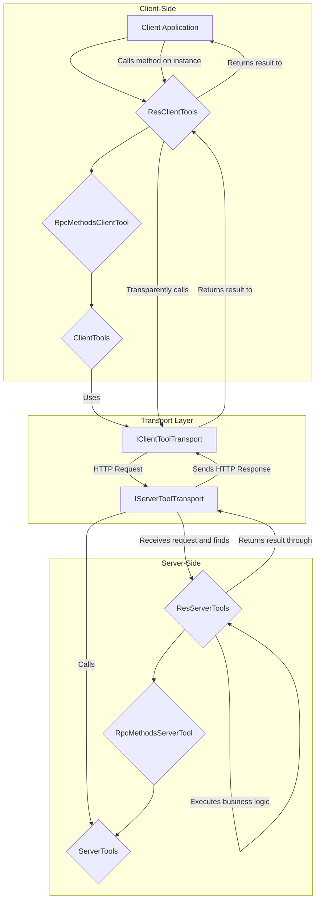

# @isdk/tool-rpc

`@isdk/tool-rpc` is a powerful TypeScript library that extends the modular capabilities of `@isdk/tool-func` to the network. It allows you to easily expose `ToolFunc` instances as a remote service and call them seamlessly from a client, just like local functions. It's perfect for building distributed AI agents, microservice architectures, or any scenario that requires tool invocation across different processes or machines.

This project is built on `@isdk/tool-func`. Before proceeding, please ensure you are familiar with its core concepts.

## ✨ Core Features

- **Layered Abstractions:** Provides a set of layered tool classes (`ServerTools`, `RpcMethodsServerTool`, `ResServerTools`) that allow you to choose the right level of abstraction for your needs.
- **🌐 RESTful Interface:** Quickly create REST-style APIs using `ResServerTools`, which automatically handles standard operations like `get`, `list`, `post`, `put`, and `delete`.
- **🔧 RPC Method Grouping:** Use `RpcMethodsServerTool` to bundle multiple related functions (methods) under a single tool, invoked via an `act` parameter.
- **🔌 Automatic Client-Side Proxies:** The client (`ClientTools` and its subclasses) can automatically load tool definitions from the server and dynamically generate type-safe proxy functions, making remote calls as simple as local ones.
- **🚀 Built-in HTTP Transport:** Comes with `HttpServerToolTransport` based on Node.js's `http` module and `HttpClientToolTransport` based on `fetch`, ready to use out of the box.
- **🌊 Streaming Support:** Both server and client support `ReadableStream`, enabling easy implementation of streaming data responses.

## 📦 Installation

```bash
npm install @isdk/tool-rpc @isdk/tool-func
```

## 🚀 Quick Start

The following example demonstrates how to create a RESTful tool, expose it on a server, and call it from a client.

### Step 1: Define the Server-Side Tool

Create a class that extends `ResServerTools`. Implement standard methods like `get` and `list`, as well as any custom business logic in methods prefixed with `$`.

```typescript
// ./tools/UserTool.ts
import { ResServerTools, ResServerFuncParams } from '@isdk/tool-rpc';
import { NotFoundError } from '@isdk/common-error';

// In-memory database for demonstration
const users: Record<string, any> = {
  '1': { id: '1', name: 'Alice' },
  '2': { id: '2', name: 'Bob' },
};

export class UserTool extends ResServerTools {
  // Standard RESTful method: GET /api/users/:id
  get({ id }: ResServerFuncParams) {
    const user = users[id as string];
    if (!user) throw new NotFoundError(id as string, 'user');
    return user;
  }

  // Standard RESTful method: GET /api/users
  list() {
    return Object.values(users);
  }

  // Custom RPC-style method
  $promote({ id }: ResServerFuncParams) {
    const user = users[id as string];
    if (!user) throw new NotFoundError(id as string, 'user');
    return { ...user, role: 'admin' };
  }
}
```

### Step 2: Set Up and Start the Server

In your server entry file, instantiate your tools, then set up and start the `HttpServerToolTransport`.

```typescript
// ./server.ts
import { HttpServerToolTransport, ResServerTools } from '@isdk/tool-rpc';
import { UserTool } from './tools/UserTool';

async function startServer() {
  // 1. Instantiate and register your tool.
  // The name 'users' will be used as part of the URL (e.g., /api/users)
  new UserTool('users').register();

  // 2. Initialize the server transport.
  const serverTransport = new HttpServerToolTransport();

  // 3. Mount the tool's base class. The transport will find all registered
  //    instances of ResServerTools.
  //    This creates API endpoints under the '/api' prefix.
  serverTransport.mount(ResServerTools, '/api');

  // 4. Start the server.
  const port = 3000;
  await serverTransport.start({ port });
  console.log(`✅ Tool server started, listening on http://localhost:${port}`);
}

startServer();
```

### Step 3: Set Up and Use the Client

In your client-side code, initialize the `HttpClientToolTransport`, which will automatically load tool definitions from the server and create proxies.

```typescript
// ./client.ts
import { HttpClientToolTransport, ResClientTools } from '@isdk/tool-rpc';

// Define a type for full type-safety, including the custom method
type UserClientTool = ResClientTools & {
  promote(params: { id: string }): Promise<{ id: string; name: string; role: string }>;
};

async function main() {
  const apiRoot = 'http://localhost:3000/api';

  // 1. Initialize the client transport.
  const clientTransport = new HttpClientToolTransport(apiRoot);

  // 2. Mount the client tools. This action will:
  //    a. Set the transport for ResClientTools.
  //    b. Load API definitions from the server and create proxy tools.
  await clientTransport.mount(ResClientTools);

  // 3. Get the dynamically created proxy for the remote tool.
  const userTool = ResClientTools.get('users') as UserClientTool;
  if (!userTool) {
    throw new Error('Remote tool "users" not found!');
  }

  // 4. Call the remote APIs as if they were local methods!

  // Calls GET /api/users/1
  const user = await userTool.get!({ id: '1' });
  console.log('Fetched User:', user); // { id: '1', name: 'Alice' }

  // Calls GET /api/users
  const allUsers = await userTool.list!();
  console.log('All Users:', allUsers); // [{...}, {...}]

  // Calls the custom RPC method $promote
  // The client proxy automatically handles the `act` parameter.
  const admin = await userTool.promote({ id: '2' });
  console.log('Promoted User:', admin); // { id: '2', name: 'Bob', role: 'admin' }
}

main();
```

## Core Concepts: Layered Abstractions

The core design of `@isdk/tool-rpc` is a layered architecture that cleanly separates network communication from business logic. You can choose the right level of abstraction based on the complexity of your needs.



### A Note on Naming: `ServerTools` (Plural) vs. Instance (Singular)

You might notice that the class names `ServerTools`, `ClientTools`, etc., are plural. This is an intentional design choice that reflects their dual role:

- **The Static Class as a Registry (The Plural 'Tools')**: The static part of `ServerTools` (e.g., `ServerTools.register()`, `ServerTools.items`) acts as a **global registry and manager** for all remote tools. It holds the collection of tools and provides static methods to manage them. This is where the "Tools" (plural) in the name comes from.

- **An Instance as a Single Tool (The Singular 'Tool')**: When you create an instance (e.g., `new ServerTools({ name: 'myTool', ... })`), you are defining a **single, concrete tool**. The instance encapsulates the logic, metadata, and configuration for one individual function.

In short: **The class is the collection of tools; an instance is a single tool.** This design provides a clean separation between the management of tools (static) and the definition of a tool (instance).

### Layer 1: `ServerTools` / `ClientTools` - The Basic Remote Function

This is the most fundamental layer, representing a single, remotely callable function.

- **`ServerTools`**:
  - **Concept**: An individual, remotely executable function.
  - **Use Case**: This is the simplest approach when you just need to expose a few scattered functions that don't have a strong relationship with each other.
  - **Advanced Usage**: Inside the `func`, you can access the raw HTTP request and response objects via `params._req` and `params._res` for lower-level control.
  - **Example**:

    ```typescript
    // server.ts
    new ServerTools({
      name: 'ping',
      isApi: true, // Mark as discoverable
      func: () => 'pong',
    }).register();
    ```

- **`ClientTools`**:
  - **Concept**: The client-side proxy for a `ServerTools` instance on the server.
  - **How it Works**: After `client.init()`, it creates a `ClientTools` instance named `ping`. When you call `ToolFunc.run('ping')`, it sends the request over the network to the server.

### Layer 2: `RpcMethodsServerTool` / `RpcMethodsClientTool` - The Object-Oriented Service

This layer organizes multiple related functions into a collection that resembles an "object" or "service".

- **`RpcMethodsServerTool`**:
  - **Concept**: A "service" object containing multiple callable methods. It acts as a dispatcher.
  - **Use Case**: Use this class to better organize your code when you have a group of cohesive operations (e.g., a `UserService` with `createUser`, `updateUser`, `getUser`).
  - **How it Works**: Methods defined in the class with a `$` prefix (e.g., `$createUser`) are automatically registered as RPC methods. The client specifies which method to call by passing `act: '$createUser'` in the request.
  - **Example**:

    ```typescript
    // server.ts
    class UserService extends RpcMethodsServerTool {
      $createUser({ name }) {
        // ... logic to create a user
        return { id: 'user-1', name };
      }
      $getUser({ id }) {
        // ... logic to get a user
        return { id, name: 'Test User' };
      }
    }
    new UserService('userService').register();
    ```

- **`RpcMethodsClientTool`**:
  - **Concept**: The client-side proxy for the remote service object.
  - **How it Works**: On initialization, it detects the `$createUser` and `$getUser` methods on the server and dynamically creates corresponding `createUser()` and `getUser()` methods on the client instance. This makes the invocation look like a local object method call, completely hiding the underlying `act` parameter and network communication.
  - **Example**:

    ```typescript
    // client.ts
    const userService = RpcMethodsClientTool.get('userService');
    const newUser = await userService.createUser({ name: 'Alice' });
    ```

### Layer 3: `ResServerTools` / `ResClientTools` - The RESTful Resource

This is the highest-level abstraction, providing a resource-centric, RESTful-style API on top of RPC.

- **`ResServerTools`**:
  - **Concept**: Represents a RESTful resource with built-in mapping for standard HTTP verbs (GET, POST, PUT, DELETE).
  - **Use Case**: Ideal for scenarios requiring standard CRUD (Create, Read, Update, Delete) operations, such as managing `users` or `products` resources.
  - **How it Works**: It extends `RpcMethodsServerTool` and pre-defines special methods like `get`, `list`, `post`, `put`, `delete`. The HTTP transport layer intelligently calls the appropriate method based on the request's `method` (GET/POST) and whether an `id` is present in the URL.
    - `GET /users/:id` -> `get({ id })`
    - `GET /users` -> `list()`
    - `POST /users` -> `post({ val })`
  - **Advanced Usage**: Since it extends `RpcMethodsServerTool`, you can still define custom `$` methods in a `ResServerTools` subclass, allowing you to combine RESTful patterns with specific RPC calls (as shown in the Quick Start example on this page).

- **`ResClientTools`**:
  - **Concept**: The client-side proxy for a remote RESTful resource.
  - **How it Works**: It provides a set of convenient methods like `.get()`, `.list()`, `.post()`, etc., which automatically construct and send requests that conform to REST semantics.
  - **Example**:

    ```typescript
    // client.ts
    const userRes = ResClientTools.get('users');
    const user = await userRes.get({ id: '1' }); // Sends GET /api/users/1
    const allUsers = await userRes.list();       // Sends GET /api/users
    ```

## 🔌 The Transport Layer

The transport layer is a core pillar of `@isdk/tool-rpc`, acting as the communication bridge between server tools and client tools to enable true Remote Procedure Calls (RPC).

### Design Philosophy

The core design philosophy of the transport layer is the **separation of concerns**. It completely decouples the business logic of your tools (what you define in a `Tool`) from the implementation details of network communication (like protocol, routing, and serialization). This keeps your tool code pure and portable, without needing to know whether it's communicating over HTTP, WebSockets, or any other protocol. You define what your tool does, and the transport layer handles the rest.

### Core Abstractions

The architecture is built around a few key interfaces:

- **`IToolTransport`**: The common base interface for all transports, defining basic operations like `mount`.
- **`IServerToolTransport`**: The interface that a server-side transport must implement. Its core responsibilities are:
    1. **Exposing a Discovery Endpoint**: Create a route, typically `GET` (e.g., `/api`), which, when accessed by a client, returns the JSON definitions of all registered and available tools. This is achieved via the `addDiscoveryHandler` method.
    2. **Handling RPC Calls**: Create a generic RPC route (e.g., `/api/:toolId`) that receives requests, finds the corresponding tool by `toolId`, executes it, and returns the result. This is handled by the `addRpcHandler` method.
    3. Managing the server lifecycle (`start`, `stop`).
- **`IClientToolTransport`**: The interface that a client-side transport must implement. Its core responsibilities are:
    1. **Loading API Definitions**: Call the `loadApis()` method, which accesses the server's discovery endpoint to get the definitions of all tools.
    2. **Executing Remote Calls**: Implement the `fetch()` method, which is responsible for serializing the client's tool call (function name and parameters), sending it to the server's RPC endpoint, and processing the response.

### Built-in HTTP Transport

The library provides a plug-and-play, HTTP-based transport implementation that requires no extra configuration:

- **`HttpServerToolTransport`**: A server-side transport that uses Node.js's built-in `http` module to create a lightweight server. When you call `serverTransport.mount(ServerTools, '/api')`, it automatically:
  - Creates a `GET /api` route for service discovery.
  - Creates a `POST /api/:toolId` route (and supports other methods) to handle RPC calls for all tools. It intelligently parses tool parameters from the request body or URL parameters.

- **`HttpClientToolTransport`**: A client-side transport that uses the cross-platform `fetch` API to send requests to the server. When you call `client.init()` (which uses `loadApis` internally), it requests `GET /api`. When you run a tool, it sends a JSON request with parameters to `POST /api/toolName`.

### Extending the Functionality: Creating Your Own Transport

`@isdk/tool-rpc` is designed to be fully extensible. You can create your own transport layer to support different protocols (like WebSockets, gRPC) or to integrate with existing web frameworks (like Express, Koa, or Fastify) by implementing the interfaces described above.

**Idea for a Fastify Integration**:

1. Create a `FastifyServerTransport` class that implements `IServerToolTransport`.
2. In the `mount` method, instead of creating a new `http` server, you would accept an existing `FastifyInstance` as an option.
3. Use `fastify.get(apiPrefix, ...)` to register the discovery route, with a handler that calls `ServerTools.toJSON()`.
4. Use `fastify.all(apiPrefix + '/:toolId', ...)` to register the RPC route. The handler would extract parameters from `request.body` or `request.query`, call the appropriate tool, and use `reply` to send the response.
5. The `start` and `stop` methods could delegate to the Fastify instance's `listen` and `close` methods.

This pluggable architecture gives `@isdk/tool-rpc` immense flexibility, allowing it to easily adapt to various project requirements and tech stacks.

## Advanced Usage

This section covers some of the more powerful features of `@isdk/tool-rpc` for building flexible and efficient applications.

### Exporting Functions for Client-Side Execution

In some scenarios, you might want to offload computation from the server or allow the client to execute a function locally. The `allowExportFunc` option enables this by serializing the function's body and sending it to the client during the discovery phase. When set to `true`, the client-side `ClientTools` will automatically use this downloaded function instead of making a network request.

**Server-Side Configuration:**

```typescript
// server.ts
new ServerTools({
  name: 'local-uuid',
  isApi: true,
  allowExportFunc: true, // Allow this function to be downloaded
  func: () => {
    // This logic will be executed on the client
    console.log('Generating UUID on the client...');
    return Math.random().toString(36).substring(2, 15);
  },
}).register();
```

**Client-Side Usage:**

```typescript
// client.ts
const uuidTool = ClientTools.get('local-uuid');
// This call executes the downloaded function body. No network request is made.
const uuid = await uuidTool.run();
console.log('Generated UUID:', uuid);
```

### Automatic RESTful Method Routing

When using `ResServerTools`, the framework intelligently routes incoming HTTP requests. It inspects the HTTP method and the presence of an `id` parameter to determine which function to call. This logic, handled by `getMethodFromParams` within the tool, provides the following mappings out-of-the-box:

- `GET /api/my-resource` → `list()`
- `GET /api/my-resource/123` → `get({ id: '123' })`
- `POST /api/my-resource` → `post({ val: ... })`

This allows you to write clean, resource-oriented code without worrying about manual routing.

### Hybrid RESTful and RPC Tools

Since `ResServerTools` extends `RpcMethodsServerTool`, you can combine both API styles in a single tool. You can implement standard RESTful methods (`get`, `list`) while also adding custom RPC-style methods (e.g., `$archive`, `$publish`) for specific business operations that don't fit the CRUD model.

### Automatic Parameter Type Casting

The `params` schema you define on a tool is used for more than just documentation. The server automatically uses it to cast incoming parameters to their specified types. For example, if you define `id: { type: 'number' }`, any `id` received from a URL path (which is a string) will be converted to a `Number` before your function is called.

### Client-Side Method Aliasing

For convenience, when you define a method with a `$` prefix on the server (e.g., `$promoteUser`), the client-side proxy automatically creates a cleaner alias without the prefix. This allows you to call `myTool.promoteUser(...)` on the client, making the code more readable and idiomatic.

## 🤝 Contributing

We welcome contributions of all kinds! Please read the [CONTRIBUTING.md](./CONTRIBUTING.md) file for guidelines on how to get started.

## 📄 License

This project is licensed under the MIT License. See the [LICENSE-MIT](./LICENSE-MIT) file for more details.
