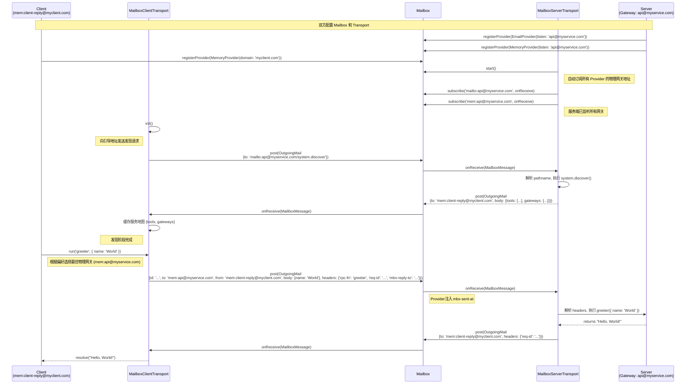

# 与 `@isdk/tool-rpc` 的集成

## 1. 网关模式与服务发现

为了实现最大程度的解耦和自动化，`Mailbox` 与 `tool-rpc` 的集成采用**网关模式 (Gateway Pattern)**。其核心是**物理网关地址**和**逻辑收件人别名**的分离。

**核心约定：网关模式是默认且推荐的路由方式。除非有明确的必要性，否则不应改变此约定。**

- **逻辑地址 / 收件人别名 (Logical Address / Recipient Alias)**: 统一采用 `user@domain` 格式，代表一个**协议无关的服务标识符**。这是客户端想要调用的最终目标。
  * `user` 部分是目标**工具 (tool)** 的名称（例如 `greeter`）。
  * `domain` 部分是服务所在的**逻辑域**（例如 `myservice.com`）。
- **物理网关地址 (Physical Gateway Address)**: 每个 `Provider` 暴露一个单一的、稳定的入口地址，格式通常为 `protocol:api@domain`。所有发往该 `domain` 的不同工具的请求，都将被发送到这个统一的物理地址。

### 1.1. Provider 的身份约定：网关

设计的基石是，每个 `IMailboxProvider` 实例都扮演一个**网关 (Gateway)** 的角色。它通过其 `listenAddress` 声明自己监听的**物理网关地址**，并通过 `servedAddressPatterns` 属性声明自己负责的**逻辑域**。

```typescript
// @isdk/mailbox/src/interfaces.ts (设计约定)
export interface IMailboxProvider {
  readonly protocol: string;
  // Provider 监听的物理网关地址
  readonly listenAddress: URL;
  // Provider 负责的逻辑地址模式
  readonly servedAddressPatterns: string[];
  // ... 其他方法
}

// --- 在应用启动时，安全地初始化 Provider ---
// EmailProvider 作为 'myservice.com' 域的网关
const myEmailConfig = {
  // 物理监听地址
  listenAddress: 'api@myservice.com',
  // 逻辑服务地址模式
  servedAddressPatterns: ['*@myservice.com'],
  // ... smtp/imap 等其他配置
};
// Provider 内部会设置 this.listenAddress = 'api@myservice.com'
// 和 this.servedAddressPatterns = ['*@myservice.com']
const emailProvider = new EmailProvider(myEmailConfig);

// MemoryProvider 作为 'myservice.com' 域的网关
const myMemoryConfig = {
  // 物理监听地址
  listenAddress: 'api@myservice.com',
  // 逻辑服务地址模式
  servedAddressPatterns: ['*@myservice.com'],
};
// Provider 内部会设置 this.listenAddress = 'api@myservice.com'
// 和 this.servedAddressPatterns = ['*@myservice.com']
const memoryProvider = new MemoryProvider(myMemoryConfig);

// --- 注册 Provider ---
const mailbox = new Mailbox();
mailbox.registerProvider(emailProvider);
mailbox.registerProvider(memoryProvider);
```

#### `servedAddressPatterns` 属性的必要性说明

`servedAddressPatterns` 属性在 `IMailboxProvider` 接口中的存在，是实现“逻辑服务”与“物理传输”彻底解耦的关键，对于构建灵活、可扩展和易于维护的系统至关重要。

1. **明确解耦物理地址与逻辑域**：
    * `listenAddress` 描述的是 Provider 实际监听的**物理端点**（例如，一个内部队列地址 `gateway-queue@infra.internal` 或一个特定的邮件账户 `api-robot@mail.example.com`）。这通常是传输层面的细节，可能不直接与业务逻辑相关。
    * `servedDomains` 属性则明确声明了该 Provider 负责处理的**逻辑服务域**（例如 `myservice.com` 或 `legacy-api.net`）。这些是业务层面用户或客户端感知的服务地址。
    * 通过 `servedAddressPatterns`，我们可以将一个物理上不相关的地址（如 `internal-queue@infra.internal`）映射到多个业务逻辑域（如 `myservice.com`, `my-other-service.com`），从而实现物理基础设施与业务逻辑的独立演进。

2. **支持灵活的域名映射和别名**：
    * 一个 Provider 实例可能需要为多个逻辑域名提供服务。例如，一个网关可能需要同时处理来自 `api.example.com` 和 `legacy.example.net` 的请求。通过 `servedAddressPatterns: ['example.com', 'example.net']`，该 Provider 可以明确声明其职责范围。
    * 这使得系统能够轻松支持域名迁移、品牌重塑或多租户场景，而无需修改底层的物理连接配置。

3. **增强服务发现的准确性和灵活性**：
    * 在服务发现过程中，客户端需要知道哪个 Provider 能够处理特定逻辑域的请求。`servedAddressPatterns` 属性提供了一个明确的查找机制，而不是仅仅依赖于从 `listenAddress` 中推断出的单一域名。
    * 这允许客户端根据其目标逻辑域，更精确地选择合适的 Provider，即使该 Provider 的物理地址域名与逻辑域不直接匹配。

总之，`servedAddressPatterns` 属性的存在，使得 `Mailbox` 架构能够更好地应对现实世界中复杂的部署和业务需求，提供了强大的灵活性和可维护性，避免了物理实现细节对上层业务逻辑的侵蚀。

### 1.2. 服务端：监听网关

`MailboxServerTransport` 的设计旨在“零配置”运行。它不再为每个工具创建独立的订阅，而是统一订阅每个 `Provider` 的**物理网关地址**。

```typescript
// =======================================================
// === server.ts (应用入口) ===
// =======================================================
import { MailboxServerTransport, ServerTools } from '@isdk/tool-rpc';

// 1. 注册与网络无关的服务函数
new ServerTools({ name: 'greeter', isApi: true, func: (p: {name: string}) => `Hello, ${p.name}!` }).register();

// 2. 初始化 ServerTransport
const serverTransport = new MailboxServerTransport({
  mailbox: mailbox,
  address: 'mailto:api@myservice.com' // 物理网关地址
});

// 3. 启动服务
//    a. Transport 会遍历所有允许的 Provider。
//    b. Transport 会订阅 address (物理网关地址)，例如 `api@myservice.com`。
//    c. 启动顺序优化：先执行 subscribe() 确保捕捉新消息，再立即执行 drainBacklog() 处理积压消息。
//    d. 当网关地址收到消息时，Transport 的 `onReceive` 回调被触发。
//   e. `onReceive` 回调会解析消息 Headers 中的 `rpc-fn` 以确定消息的逻辑目的地 (例如 `/greeter`)。
//   f. 路由时会将 Headers 中的空字符串清理为 undefined，确保下游工具能正确识别默认参数。
//   g. 根据逻辑地址找到对应的工具并执行。
//   h. 内置的 `system.discover` 服务同样提供服务。
await serverTransport.start();
```

### 1.3. 客户端：发现与调用

客户端通过“引导地址”发现服务，获取**逻辑工具列表**和**物理网关列表**，然后将请求发往网关。

```typescript
// =======================================================
// === client.ts ===
// =======================================================
import { MailboxClientTransport, ClientTools } from '@isdk/tool-rpc';

// 1. 初始化 ClientTransport
//    a. 配置唯一的物理网关地址 serverAddress，指向服务端的某个网关入口
const clientTransport = new MailboxClientTransport(mailbox, {
  serverAddress: 'mailto:api@myservice.com', // 指向物理网关
  clientAddress: 'mailto:user@myclient.com', // 自己的唯一接收地址
  protocolPreference: ['mem', 'mailto'],
});

// 2. 初始化客户端工具
//    a. Transport 向 serverAddress 发送发现请求 (携带 Action: 'list')。
//    b. 收到包含 { tools, gateways } 的“服务地图”并缓存。
await ClientTools.init({ transport: clientTransport });

// =======================================================
// === app-logic.ts (业务逻辑) ===
// =======================================================

// 3. 发起调用
const greeter = ClientTools.get('greeter');

//    a. transport 根据自身协议偏好 ('mem', 'mailto') 和服务端支持的网关，选择最佳的物理网关地址 (例如 'mem:api@myservice.com')。
//    b. 根据工具名 ('greeter') 构建包含逻辑地址的完整目标地址 `mem:api@myservice.com/greeter`。
//    c. 发送消息:
//       - to: 'mem:api@myservice.com/greeter' (包含逻辑地址的完整地址)
//       - body: { name: 'World' }
const result = await greeter.run({ name: 'World' });
console.log(result); // "Hello, World!"
```

### 1.4. tool-rpc 路由规范：统一标准化消息头 (Standardized Headers)

在 `tool-rpc` 的 Mailbox 传输层实现中，为了确保跨协议的一致性、安全性和路由的确定性，我们**统一使用标准化消息头**来承载所有的路由元数据。

#### 标准化消息头定义

| 消息头 | 说明 | 状态 | 层级 |
|--------|------|------|------|
| `rpc-fn` | **工具/函数标识符** (Function ID) | **强制** | RPC 应用层 |
| `rpc-act` | **操作动作** (Action: get/post/list...) | **强制** (默认为 `post`) | RPC 应用层 |
| `req-id` | **请求/关联 ID** (Request ID) | **强制** | 运输/交互层 |
| `trace-id` | **全链路追踪 ID** (Trace ID) | 可选 | 业务/全局层 |
| `mbx-reply-to` | **响应应发往的目标邮箱地址** | 可选 | 邮箱传输层 |
| `rpc-res` | **资源标识符** (Resource ID) | 可选 | RPC 应用层 |

#### 统一路由策略

当 `MailboxServerTransport` 收到消息时，将**仅通过 Headers** 解析目标工具、动作和资源 ID。

**为什么不使用逻辑地址 (URL Path) 进行路由？**
虽然 `MailAddress` 支持形如 `/tool-name` 的逻辑路径，但由于底层传输协议（如 SMTP、某些 MQ）对路径的支持存在碎片化，依赖路径会导致系统在切换传输协议时出现不一致的行为。为了实现**真正的协议无关性**，`tool-rpc` 选择将路由元数据上移至 `MailMessage` 的 `headers` 中。因为 Headers 是 `Mailbox` 消息模型的标准组成部分，无论底层协议是什么，Headers 都能被可靠地传递和解析。

任何缺失 `rpc-fn` 或 `rpc-act` 的 RPC 请求将被视为非法请求。

## 2. 工作流程：一次完整的异步 RPC 调用

在新的规范下，一次完整的 RPC 调用包含**发现**和**调用**两个阶段。

1. **配置阶段**:
    * **服务端**: `Mailbox` 实例被创建，并注册了多个 `Provider`（如 `EmailProvider`, `MemoryProvider`）。每个 `Provider` 都配置了其作为**物理网关**的 `listenAddress`（例如 `api@myservice.com`）。
    * **客户端**: `Mailbox` 实例被创建。`MailboxClientTransport` 在初始化时持有 `mailbox` 实例，并被配置了服务端的 `serverAddress` (指向任一物理网关，例如 `mailto:api@myservice.com`) 和自身的 `protocolPreference`。

2. **启动与发现阶段**:
    * **服务端** `serverTransport.start()` 被调用。它会扫描 `mailbox` 中所有 `Provider`，并订阅它们的 `listenAddress`（物理网关地址）。一个内置的 `system.discover` 服务准备就绪，等待通过网关被调用。
    * **客户端** `ClientTools.init()` 被调用。`clientTransport` 向 `serverAddress` 发送发现请求（携带 `rpc-fn: 'system.discover'`）。
    * 服务端网关收到发现请求，`serverTransport` 解析 `headers['rpc-fn']`，调用 `system.discover` 服务。该服务响应请求，返回一个“服务地图”，包含：
        * `tools`: 所有已注册工具的定义列表。
        * `gateways`: 一个映射，包含各协议及其对应的物理网关地址 (e.g., `{ 'mem': 'mem:api@myservice.com', 'mailto': 'mailto:api@myservice.com' }`)。
    * 客户端 `clientTransport` 收到并缓存这份“服务地图”。

3. **调用阶段**: 业务代码调用 `client.get('greeter').run({ name: 'World' })`。
    * `clientTransport` 查找缓存的“服务地图”，确认 `greeter` 是一个合法的工具。
    * 它查看自身协议偏好 (`['mem', 'mailto']`) 和服务端支持的 `gateways`。
    * 它选择最佳的协议（例如 `mem`），并从地图中获取对应的**物理网关地址** `mem:api@myservice.com`。
    * `clientTransport` 构造一个 `OutgoingMail` 对象：
        * **`id`**: **内容 Hash ID** (例如 `hash(body + rpc-fn + ...)` )。这是**物理 ID**，用于实现【内容级幂等】，确保相同内容的信件不会被重复投递。
        * **`to`**: `mem:api@myservice.com` (物理网关地址)。
        * **`from`**: 客户端自己的地址。
        * **`body`**: `{ name: 'World' }`。
        * **`headers`**:
            * `req-id`: **关联 ID / Request ID** (例如随机 UUID)。这是**逻辑 ID**，用于在异步交互中匹配请求与响应，并实现【请求级去重】。
            * `rpc-fn`: `'greeter'`
            * `rpc-act`: `'post'`
            * `mbx-reply-to`: `this.clientAddress`
    * `clientTransport` 在内部记录该请求，然后通过 `mailbox.post()` 发送信件。

4. **处理阶段**:
    * 服务端 `mem:api@myservice.com` 网关地址收到信件。
    * `serverTransport` 解析 `headers['rpc-fn']`，于是调用 `greeter` 工具的 `run` 方法，并将 `body` 传入。

5. **响应阶段**:
    * `serverTransport` 将 `greeter` 的执行结果包装成一封回信。
    * **`to`**: 优先使用原始请求中的 `mbx-reply-to`，若无则使用 `from` 地址。
    * **`headers`**:
        * `req-id`: 原始请求的 ID。
    * 通过 `mailbox.post()` 将回信发出。

6. **完成阶段**:
    * 客户端在自己的回复地址上收到回信。
    * `clientTransport` 通过 `req-id` 头部找到对应的待处理 `Promise`，并用信件的 `body` 将其 `resolve`，完成整个调用闭环。

## 3. 优势与价值

- **高度安全**：将认证信息与地址分离，凭证由 `Provider` 在安全的配置阶段进行内部管理。
- **终极解耦**：上层业务逻辑与底层通信协议、认证方式完全解耦。
- **统一通信模型**：`Mailbox` 不仅能承载 RPC，也能作为 `@isdk/tool-event` 等发布/订阅系统的底层传输。
- **协议灵活性**：可轻松添加新 `Provider` 以支持新协议。
- **简化测试**：使用 `MemoryProvider`，可在单个进程内高效地对整个分布式系统进行测试。
- **异步与离线**：天然适合构建事件驱动、响应式乃至离线的系统。
- **生命周期所有权 (Ownership)**：遵循“谁创建，谁负责”原则。只有 Transport 内部创建的 Mailbox 才会随 Transport 停止而关闭，共享的 Mailbox 受到保护，确保复杂场景下的资源安全释放。

## 4. 消息跟踪机制实现细节

为了将草案中的理念转化为具体的代码，本节将详细阐述在 `MailboxClientTransport` 中实现消息跟踪机制的核心逻辑。该机制是确保异步 RPC 调用可靠性的关键。

### 4.1. 核心组件与内部状态

`MailboxClientTransport` 是实现跟踪机制的核心。它需要维护一个内部状态，用于存放所有“飞行中”的请求，以及从服务端发现的服务信息。

```typescript
// 在 MailboxClientTransport 内部

interface PendingRequest {
  resolve: (value: any) => void;
  reject: (reason?: any) => void;
  timeoutTimer: NodeJS.Timeout;
}

private pendingRequests: Map<string, PendingRequest> = new Map();
private defaultTimeout: number = 30000; // 默认超时时间 (ms)

// 从服务端发现的物理网关地址映射
private gatewayMap: { [protocol: string]: URL } = {};
// 用于投递的目标物理地址，在构造函数中传入 serverAddress 或 apiRoot
private serverAddress: URL;
// 自己的唯一接收地址，在构造函数中传入
private clientAddress: string;
// 资源所有权标记
private isInternalMailbox: boolean;
// 协议偏好列表，用于选择最佳物理地址，在构造函数中传入
private protocolPreference: string[] = [];
```

- `pendingRequests`: 一个 `Map` 对象，键是唯一的关联 ID (即消息 `id`)，值是一个包含 `Promise` 的 `resolve`、`reject` 函数以及一个超时计时器的对象。

### 4.2. 工作流程详解

#### 4.2.1. 发送请求 (`run` 方法)

当上层调用 `client.get('...').run()` 时，`MailboxClientTransport` 的 `run` (或类似) 方法会执行以下操作：

1. **生成唯一关联 ID (Correlation ID)**: 创建一个全局唯一的关联 ID，它将作为 `req-id` 头部，用于匹配响应。推荐使用 `uuid` 库。

    ```typescript
    import { v4 as uuidv4 } from 'uuid';
    const correlationId = uuidv4();
    ```

2. **生成消息内容 ID (Message ID)**: 建议使用内容 Hash (如 `sha256`) 作为消息的物理 ID，以实现内容级幂等。

    ```typescript
    import { hash } from '@isdk/hash';
    const messageId = hash({ ...params, toolName });
    ```

3. **创建并存储 Promise**: 使用 `correlationId` (即 `req-id`) 作为键，将 `Promise` 的 `resolve` 和 `reject` 函数连同超时计时器一起存入 `pendingRequests`。

    ```typescript
    const promise = new Promise((resolve, reject) => {
      const timeoutTimer = setTimeout(() => {
        // 超时后，从 Map 中删除并拒绝 Promise
        this.pendingRequests.delete(correlationId);
        reject(new Error(`Request timed out after ${this.defaultTimeout}ms`));
      }, this.defaultTimeout);

      this.pendingRequests.set(correlationId, { resolve, reject, timeoutTimer });
    });
    ```

4. **选择并构建目标地址**: (保持原样)

    ```typescript
    // ...
    ```

5. **构建并发送消息**: 构造 `OutgoingMail` 对象，将 `messageId` 设为 `id`，将 `correlationId` 设为 `req-id`。

    ```typescript
    const outgoingMail: OutgoingMail = {
      id: messageId,       // 物理唯一标识：内容 Hash
      to: finalAddress,    // 物理网关地址
      from: this.clientAddress,
      body: { ...params },
      headers: {
        'req-id': correlationId,      // 逻辑交互标识：UUID
        'mbx-reply-to': this.clientAddress,
        'rpc-fn': toolName,
        'rpc-act': 'post',
      },
    };
    // 异步发送，无需等待
    this.mailbox.post(outgoingMail);
    ```

6. **返回 Promise**: 将第 3 步创建的 `Promise` 返回给调用方。

#### 4.2.2. 接收响应 (`onReceive` 方法)

`MailboxClientTransport` 在初始化时，必须订阅自己的客户端地址，以便接收服务器的响应。其 `onReceive` 回调函数负责处理所有收到的消息。

1. **解析响应消息**: 从收到的 `MailMessage` 的 `headers` 中提取 `req-id` 作为关联 ID。

    ```typescript
    // onReceive(message: MailboxMessage)
    const correlationId = message.headers['req-id'];
    if (!correlationId || typeof correlationId !== 'string') {
      // 非 RPC 回复消息，忽略或按其他逻辑处理
      return;
    }
    ```

2. **查找待处理请求**: 使用 `correlationId` 在 `pendingRequests` 中查找对应的条目。

    ```typescript
    const pending = this.pendingRequests.get(correlationId);
    if (!pending) {
      // 找不到匹配的请求（可能已超时或已处理），记录日志并忽略
      console.warn(`Received a reply for an unknown or timed-out request: ${correlationId}`);
      return;
    }
    ```

3. **清理并结算 Promise**:
    - **清除超时计时器**: 这是至关重要的一步，防止 `reject` 被错误地调用。

      ```typescript
      clearTimeout(pending.timeoutTimer);
      ```

    - **处理响应**: 检查消息体 `body` 是否为错误对象。根据结果调用 `resolve` 或 `reject`。

      ```typescript
      // 约定：响应体格式为 { result: ... } 或 { error: ... }
      if (message.body?.error) {
        // 使用 RemoteError (基于 @isdk/common-error) 还原远端异常
        pending.reject(RemoteError.fromJSON(message.body));
      } else {
        pending.resolve(message.body.result);
      }
      ```

    - **删除记录**: 从 `pendingRequests` 中删除该条目，释放内存。

      ```typescript
      this.pendingRequests.delete(correlationId);

    ```

通过以上设计，`MailboxClientTransport` 便拥有了一个健壮的、支持超时处理的异步请求-响应跟踪机制。

## 5. 附录：异步 RPC 调用时序图



## 6. 核心功能：Pull 模式与可靠性

除了默认的 **Push (订阅)** 模式，`MailboxServerTransport` 还支持 **Pull (拉取)** 模式，以应对高负载或需要背压 (Backpressure) 的场景。在此模式下，服务端通过循环调用 `mailbox.fetch()` 来获取消息，从而实现对消费速率的精确控制。

```typescript
const serverTransport = new MailboxServerTransport({
  address: 'mem://api@server/api',
  mode: 'pull',       // 启用拉取模式
  pullInterval: 1000, // 每隔 1 秒拉取一次
});
```
