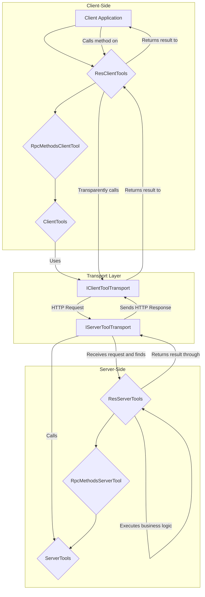

# AI-Tools Transport Layer: A Developer's Guide

This guide provides a comprehensive overview of the `ai-tool` transport layer, a powerful system designed to facilitate communication between server-side functions and client-side applications. It enables seamless Remote Procedure Calls (RPC) by abstracting the underlying network protocol.

**Prerequisite:** This document assumes you have a basic understanding of the `ToolFunc` framework. If not, please review the [`toolFunc-readme.md`](./toolFunc-readme.md) first.

## Core Architecture

The transport layer consists of three main parts:

1. **Tool Hierarchy**: A set of classes (`ServerTools`, `ClientTools`, and their derivatives) that define the structure and behavior of server-side and client-side functions.
2. **Transport Abstractions**: A collection of interfaces and abstract base classes (`IToolTransport`, `IServerToolTransport`, `IClientToolTransport`) that define the communication contract.
3. **Concrete Implementations**: Ready-to-use classes that implement the transport protocol, such as `FastifyServerToolTransport` for the server and `HttpClientToolTransport` for the client.



---

## 1. The Tool Hierarchy

The entire system is built upon `ToolFunc`, with specialized classes for server and client operations.

### `ServerTools` / `ClientTools`

- **`ServerTools`**: The foundation for any function you want to expose over the network. It runs on the server and contains the actual execution logic. Its static `toJSON()` method is crucial for serializing the list of available tools for clients.
- **`ClientTools`**: The client-side counterpart. It acts as a proxy or "stub" for a remote `ServerTools` instance. When a method is called on a `ClientTools` instance, it doesn't execute any logic itself; instead, it uses the configured transport to send the request to the server.

### `RpcMethodsServerTool` / `RpcMethodsClientTool`

This pair extends the base tools to create a more powerful RPC-style tool.

- **`RpcMethodsServerTool`**: Allows you to group multiple functions (methods) within a single "tool". It automatically discovers methods in your class that start with a `$` prefix (e.g., `$add`, `$customMethod`) and exposes them. A special `act` parameter in the request is used to specify which method to call.
- **`RpcMethodsClientTool`**: The corresponding client class. When it's initialized from the server's definition, it dynamically creates proxy methods on the instance (e.g., `add()`, `customMethod()`) that automatically handle passing the correct `act` parameter to the transport.

### `ResServerTools` / `ResClientTools`

This is the highest-level abstraction, providing a RESTful-like interface over the RPC mechanism.

- **`ResServerTools`**: Extends `RpcMethodsServerTool` to map standard HTTP-like verbs to specific class methods.
  - `GET /<toolName>/:id` maps to the `get({id})` method.
  - `GET /<toolName>` maps to the `list()` method.
  - `POST /<toolName>` maps to the `post({val})` method.
  - `DELETE /<toolName>/:id` maps to the `delete({id})` method.
  - It still supports custom `$`-prefixed methods, which are typically invoked via `POST`.
- **`ResClientTools`**: The client-side proxy that provides a natural, REST-like API (`.get()`, `.list()`, `.post()`, etc.) for interacting with a `ResServerTools` endpoint.

---

## 2. Transport Abstractions & Implementations

- **`IServerToolTransport`**: The contract for server-side transports. Its key methods are `mount()` (to set up API endpoints for the tools), `start()` (to begin listening for connections) and `stop()` (to stop listening).
- **`IClientToolTransport`**: The contract for client-side transports. Its key methods are `loadApis()` (to fetch tool definitions from the server) and `fetch()` (to execute a remote tool).
- **`FastifyServerToolTransport`**: A concrete server implementation using the [Fastify](https://www.fastify.io/) framework. It automatically creates two types of endpoints when mounted:
    1. **Discovery Endpoint**: A `GET` route on the `apiRoot` (e.g., `GET /api`) which returns a JSON list of all registered `ServerTools`.
    2. **RPC Endpoint**: A general-purpose `ALL` route (e.g., `ALL /api/:toolId/:id?`) that catches all tool calls, finds the appropriate tool by name (`:toolId`), and executes it with the request parameters.
- **`HttpClientToolTransport`**: A concrete client implementation using the standard `fetch` API. It's compatible with browsers and Node.js.

---

## 3. End-to-End Developer Workflow

This example, based on `test/rpc-transport.test.ts`, demonstrates how to create, expose, and consume a full-featured RESTful tool.

### Step 1: Define a Server-Side Tool

Create a class that extends `ResServerTools`. Implement the standard methods (`get`, `list`, etc.) and any custom business logic in methods prefixed with `$`.

```typescript
// In your server-side code (e.g., /tools/TestResTool.ts)
import { ResServerTools, ResServerFuncParams, NotFoundError } from '@isdk/ai-tool';

class TestResTool extends ResServerTools {
  // In-memory data for demonstration
  items: Record<string, any> = {
    '1': { id: '1', name: 'Item 1' },
    '2': { id: '2', name: 'Item 2' },
  };

  // A custom RPC-style method
  $customMethod({ id }: ResServerFuncParams) {
    const item = this.items[id as string];
    if (!item) throw new NotFoundError(id, 'res');
    return { ...item, custom: true };
  }

  // Standard RESTful methods
  get({ id }: ResServerFuncParams) {
    const item = this.items[id as string];
    if (!item) throw new NotFoundError(id, 'res');
    return item;
  }

  list() {
    return this.items;
  }

  delete({ id }: ResServerFuncParams) {
    if (!this.items[id as string]) throw new NotFoundError(id, 'res');
    delete this.items[id as string];
    return { id, status: 'deleted' };
  }
}
```

### Step 2: Set Up the Server

In your main server file, instantiate your tools, register them, and then mount and start the transport.

```typescript
// In your server entry file (e.g., server.ts)
import { ResServerTools, FastifyServerToolTransport } from '@isdk/ai-tool';
import { TestResTool } from './tools/TestResTool'; // Assuming you created the class above

async function main() {
  // 1. Instantiate and register your tool(s).
  // The name 'resTest' will be used as the URL part.
  new TestResTool('resTest').register();

  // 2. Initialize the server transport.
  const serverTransport = new FastifyServerToolTransport();

  // 3. Mount the tool's base class. The transport will find all registered
  //    instances of ResServerTools (and its children).
  //    This creates endpoints under the '/api' prefix.
  serverTransport.mount(ResServerTools, '/api');

  // 4. Start the server.
  const port = 3003;
  await serverTransport.start({ port });
  console.log(`Server listening at http://localhost:${port}/api`);
}

main();
```

### Step 3: Set Up and Use the Client

On the client-side, you initialize the transport and use it to automatically configure the `ClientTools` classes.

```typescript
// In your client-side code
import { ResClientTools, HttpClientToolTransport } from '@isdk/ai-tool';

async function main() {
  const apiRoot = 'http://localhost:3003/api';

  // 1. Initialize the client transport with the server's URL.
  const clientTransport = new HttpClientToolTransport(apiRoot);

  // 2. Mount the client tools. This is a helper that does two things:
  //    a. Calls ResClientTools.setTransport(clientTransport)
  //    b. Calls ResClientTools.loadFrom() to fetch definitions from the server
  //       and create the client-side proxy tools.
  await clientTransport.mount(ResClientTools);

  // 3. Get the dynamically created proxy for your remote tool.
  const resTool = ResClientTools.get('resTest') as ResClientTools & { customMethod: Function };
  if (!resTool) {
    throw new Error('Remote tool "resTest" not found!');
  }

  // 4. Call the methods as if they were local!

  // Calls GET /api/resTest
  const allItems = await resTool.list!();
  console.log('All Items:', allItems);

  // Calls GET /api/resTest/1
  const item1 = await resTool.get!({ id: 1 });
  console.log('Item 1:', item1);

  // Calls the custom method via POST /api/resTest
  // The client tool wrapper knows to send { act: '$customMethod' } in the body.
  const customResult = await resTool.customMethod({ id: 2 });
  console.log('Custom Method Result:', customResult);
}

main();
```

This architecture provides a clean, powerful, and extensible way to build and consume APIs, separating business logic from the complexities of network communication.
