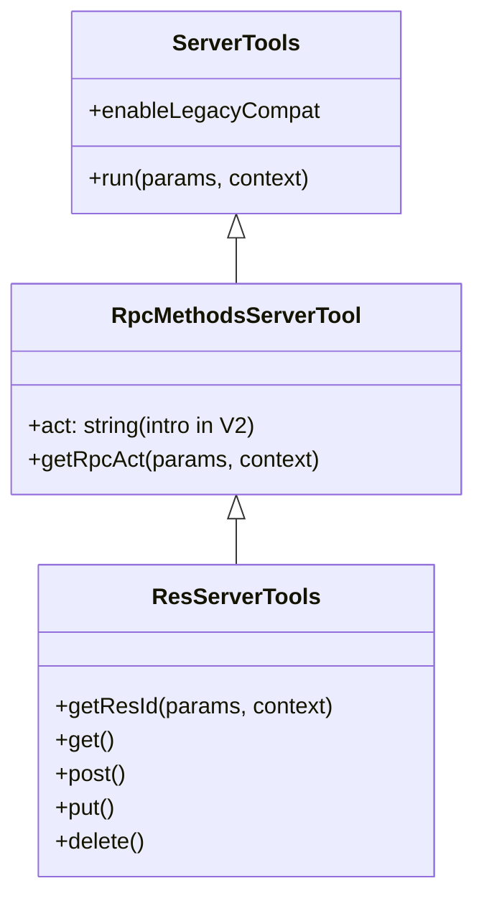

# Tool-RPC V2 传输层架构指南 (详尽版)

欢迎使用 Tool-RPC V2 传输层。本模块提供了一套标准化、高性能且可扩展的远程工具调用 (RPC) 基础设施，支持多种传输协议（HTTP/Mailbox）、流式响应、后台任务自动管理及深度链路追踪。

---

## 1. 设计哲学与核心理念

V2 版本是对 V1 架构的彻底重构，旨在解决复杂业务场景下的解耦、路由歧义及长任务处理问题。

### 1.1 协议中立 (Protocol Agnostic)
业务逻辑层（Dispatcher/Registry）不再感知底层的物理链路（如 Node.js 的 `IncomingMessage` 或 Mailbox 的 `MailMessage`）。所有物理请求在进入调度器前均被归一化为标准的 `ToolRpcRequest`。

### 1.2 资源导向寻址 (Resource-Oriented Routing)
引入 **资源 ID (resId)** 和 **动作 (act)** 的概念。
*   在 HTTP 传输中，这对应于 RESTful URL 模式：`POST /api/:toolId/:resId?act=:act`。
*   在 RPC 语义中，这解决了“一个工具处理多个相关联资源实例”的问题，而无需在 `params` 业务负载中混杂路由控制字段。

### 1.3 上下文驱动 (Context-Driven)
工具函数现在接收两个参数：`params` (业务负载) 和 `context` (`ToolRpcContext`)。
*   **params**：纯净的业务数据，建议不含控制逻辑。
*   **context**：包含 `resId`、`act`、`requestId`、`traceId`、`signal` (用于检测客户端断开或超时) 等。

---

## 2. 核心数据结构定义

### 2.1 ToolRpcRequest (归一化请求)
这是传输层（Transport）传递给调度器（Dispatcher）的标准数据包。

```typescript
export interface ToolRpcRequest {
  apiUrl: string;      // 完整的 API 基础路径
  toolId: string;      // 目标工具或函数名
  act?: string;        // 动作指令 (Action)
  resId?: string;      // 资源唯一标识符 (Resource ID)
  traceId?: string;    // 全局链路追踪 ID
  requestId: string;   // 本次 RPC 的唯一请求 ID (必须由客户端生成或传输层补全)
  params: any;         // 已解构的业务参数负载
  headers: Record<string, string | number | string[] | undefined>; // 归一化后的 Header 集合
  raw?: any;           // 物理层原生请求对象的逃生口
}
```

### 2.2 ToolRpcContext (执行上下文)
提供给工具函数在运行时获取元数据和控制信息的接口。

```typescript
export interface ToolRpcContext {
  requestId: string;
  traceId?: string;
  resId?: string;
  act?: string;
  headers: Record<string, any>;
  signal?: AbortSignal;    // 任务取消信号（超时或客户端主动断开时触发）
  dispatcher: any;         // 当前 Dispatcher 实例引用，用于递归调用其他工具
  req?: any;               // 兼容性：原位请求对象的别名
  reply?: any;             // 兼容性：响应对象的别名
}
```

---

## 3. 管理中心 (RpcTransportManager)

`RpcTransportManager` 是 V2 架构的入口点，负责协调所有 Transport 实例。

### 3.1 核心职责与 API
*   **bindScheme**：支持多种方式绑定协议实现类：
    *   **单/多 Scheme**：`bindScheme(['http', 'https'], HttpClient)`
    *   **动态解析器 (Resolver)**：`bindScheme((scheme) => scheme.startsWith('mem') ? MbxTransport : null)`。允许系统根据物理 Provider 动态响应任意 URL 格式。
*   **实例复用**：根据 `apiUrl` 缓存 Transport 实例，避免重复创建物理资源。
*   **安全验证**：提供 `validateRpcRequest` 钩子，默认支持对本地回环地址等敏感模式的限制，并允许子类重写以实现更复杂的权限验证或 SSRF 防护。
*   **单例模式**：通过 `RpcTransportManager.instance` 进行统一管理。
*   **生命周期管理**：通过 `manager.stopAll()` 优雅关闭所有已注册的 Transport 资源。

### 3.2 实例化与管理 (示例)

```typescript
import { RpcTransportManager } from './transportsV2/manager';
import { HttpServerToolTransport } from './transportsV2/http-server';

const manager = RpcTransportManager.instance;

// 1. 注册服务端实现
const serverTransport = new HttpServerToolTransport({ 
  apiUrl: 'http://0.0.0.0:3000/api' 
});
manager.addServer(serverTransport);

// 2. 批量启动与停止
await manager.startAll();
await manager.stopAll();
```


## 4. 标准 Header 与协议规范

V2 传输层定义了一套标准的协议头，用于在不同物理介质间传递路由信息：

| Header 键 (`models.ts`) | Header 物理键 | 描述 |
| :--- | :--- | :--- |
| `RPC_HEADERS.TOOL_ID` | `x-rpc-func` | 目标工具 ID |
| `RPC_HEADERS.RES_ID` | `x-rpc-res-id` | 目标资源 ID |
| `RPC_HEADERS.ACT` | `x-rpc-act` | 目标动作 Action (以 `$` 开头表示内置) |
| `RPC_HEADERS.TRACE_ID` | `x-rpc-trace-id` | 链路追踪 ID |
| `RPC_HEADERS.TIMEOUT` | `x-rpc-timeout` | 客户端声明的最大容忍时间 (ms) |
| - | `x-rpc-request-id` | 必须在响应中原样返回的 ID |

> [!TIP]
> **Header 优先级**：在服务端（如 MailboxServer）解析请求时，V2 协议头 (`x-rpc-func`) 的优先级始终高于 V1 协议头 (`mbx-fn-id`)。

---

## 5. 详细逻辑流程与分支

### 4.1 请求分发流程 (Dispatcher.dispatch)

1.  **路由提升 (Elevation)**：若开启了 `compat.enableParamBridge`，调度器会尝试从 `params` 中寻找 `id`/`act` 并提升到 Request 对象。
2.  **工具查找**：从 `registry` 中匹配 `toolId`。若不存在，直接返回 `404 Not Found`。
3.  **能力校验**：若请求中包含 `stream: true` 但工具未声明 `stream: true` 属性，返回 `400 Bad Request`。
4.  **超时协商**：优先级为：客户端 Header 指定 > 工具定义值 > 系统全局默认值。
5.  **Context 构造**：创建 `AbortController` 并关联超时计时器，生成 `ToolRpcContext`。
6.  **执行与异常监控**：
    *   **正常返回**：执行 `normalizeResult` 确保格式一致。
    *   **异常捕获**：
        *   若抛出 `code: 102` 且工具支持 `keepAliveOnTimeout` -> **进入后台任务逻辑 (4.2)**。
        *   若触发 `AbortSignal` -> 返回 `408 Terminated`。
        *   其他 Errors -> 提取 `code` 和 `message` 返回结构化错误。
7.  **响应回填**：强制在所有响应（成功/失败/处理中）的 Header 中回填 `x-rpc-request-id`。

### 4.2 长任务管理 (102 Processing 机制)

这是 V2 的核心杀手锏功能，用于处理如大文件处理、AI 推理等超过物理连接时长的任务。

1.  **状态降级**：当 Dispatcher 判定任务需要进入后台时，会向客户端返回 `102 Processing` 状态。
2.  **Tracker 注册**：
    *   原始任务的 `Promise` 被存入 `RpcActiveTaskTracker`。
    *   即使物理连接断开，任务依然在服务端继续执行。
    *   如果任务最终抛错，Tracker 会记录相应错误状态。
3.  **内建接口 `rpcTask`**：
    *   系统自动注册一个名为 `rpcTask` 的 `ResServerTools` 工具。
    *   **GET /api/rpcTask/:requestId**：查询任务当前状态。
        *   仍在执行：继续返回 `102`。
        *   已完成：返回 `200` 和执行结果。
        *   已失败：返回 `500` 或任务抛出的特定错误码。
    *   **POST /api/rpcTask/:requestId?act=$cancel**：中止后台任务。

---

## 6. 传输层实现细节

### 5.1 HttpServerToolTransport
*   **瀑布流寻址 (Waterfall Routing)**：
    1.  优先检测 Header 中的显式指令。
    2.  降级解析 URL Path：`/api/foo/bar` -> `toolId: foo`, `resId: bar`。
*   **HTTP 状态码映射**：
    *   `102` 信号在物理层会被发送为 **`202 Accepted`**。这是为了规避 Node.js `undici`/`fetch` 工具对 1xx 响应的非终结处理逻辑，确保客户端能正常通过 Body 解析出 102 信号。
*   **流式管道**：检测到响应数据具备 `.pipe` 方法时，自动执行 `pipe(rawRes)` 并停止 JSON 序列化。

### 5.2 MailboxServerTransport
*   **URL 寻址规范**：以 `apiUrl` 为核心，自动解析 `listenAddress` (物理监听) 和 `apiPrefix` (逻辑路径)。
*   **Header 映射与互操作**：
    *   自动将 Mailbox 专有的控制头（如 `mbx-fn-id`, `mbx-act`, `mbx-res-id`）映射为 V2 标准头。
    *   **优先级策略**：当物理消息中同时存在 `x-rpc-` 与 `mbx-` 标识时，始终优先采用 V2 标准头。
*   **智能回复地址**：支持 `mbx-reply-to` 显式重定向；缺失时自动回传给消息来源 `from`。
*   **积压处理 (Backlog)**：在 `push` 模式开启时，启动即自动清空 Mailbox 中的未决消息。

---

## 7. 工具类继承体系与动作 (Action) 机制

开发时推荐根据业务类型继承不同的基类，各基类之间存在层级继承关系：



*   **ServerTools**：最基础的工具类，仅支持单一的 `run` 执行逻辑。
*   **RpcMethodsServerTool (V2 核心增强)**：
    *   **引入 `act` (Action)**：旨在将单个工具函数扩展为类似于“服务 (Service)”的模型，允许在同一个工具 ID 下暴露多个远程方法。
    *   **路由规则**：调度器通过 `context.act` 的值，自动路由到类中以 `$` 开头的方法（如 `act: 'login'` 对应 `$login()`），或映射到 `action` 配置。
*   **ResServerTools (继承自 RpcMethods)**：
    *   **资源标识**：专门用于处理具有 `resId` (Resource ID) 的场景。
    *   **REST 语义自动映射**：如果未显式提供 `act`，它会根据 HTTP 方法自动推断：`GET` -> `get/list`, `POST` -> `post`, `PUT` -> `put`, `DELETE` -> `delete`。

---

## 8. 客户端使用范例

```typescript
import { RpcTransportManager } from './transportsV2/manager';
import { HttpClientToolTransport } from './transportsV2/http-client';

// 注册协议实现类
RpcTransportManager.bindScheme(['http', 'https'], HttpClientToolTransport);

const manager = RpcTransportManager.instance;
const transport = manager.getClient('http://localhost:3000/api');

// 示例 1: 普通调用
const result = await transport.fetch('adder', { a: 1, b: 2 });

// 示例 2: 显式指定动作和资源 ID (针对 ResServerTools)
const userInfo = await transport.fetch('user', {}, 'get', 'user-123');

// 示例 3: 调用特定子命令 (针对 RpcMethodsServerTool)
const loginRes = await transport.fetch('auth', { user: 'admin' }, 'login');

// 示例 4: 动态协议绑定 (Resolver)
RpcTransportManager.bindScheme((scheme) => {
  if (isMailboxScheme(scheme)) return MailboxClientTransport;
});

// 示例 5: 客户端自动轮询
// 若 slowTask 极其缓慢且服务端开启了 keepAlive，该方法会静默轮询直到返回 200
const longResult = await transport.fetch('slowTask', { data: 123 });
```

---

## 9. 调试指南

在测试或本地开发时，可以通过观测 Header 的返回来定位问题：
*   **RequestId 丢失**：检查传输层是否正确调用了 `echoRequestId`。
*   **路由不匹配**：检查 Header 中的 `x-rpc-func` 是否与注册名一致，或者 URL 路径前缀是否配置正确。
*   **408 超时**：检查 `x-rpc-timeout` 设置是否过短，或工具是否应该开启 `keepAliveOnTimeout` 以允许 102 转换。

---

## 10. V1 到 V2 升级指南 (Migration Guide)

V2 传输层在保持兼容性的同时，鼓励开发者迁移到“新架构优先”模式。

### 10.1 服务端平滑迁移步骤

1.  **开启兼容层**：在构造 `RpcServerDispatcher` 时，默认会开启 `compat` 选项：
    ```typescript
    const dispatcher = new RpcServerDispatcher({
       compat: { 
         enableParamBridge: true,      // 自动将 params.id/act 与 context 同步
         enableContextInjection: true  // 将原生 req/res 注入 params._req/_res
       }
    });
    ```
2.  **重命名 Header** (如果使用自定义 HTTP 请求)：
    *   `x-rpc-id` -> `x-rpc-res-id` (旧名仍作为别名支持，但建议替换)。
3.  **方法名重构**：
    *   若原本在 `ResServerTools` 中直接使用 `params.id`，建议改为通过 `context.resId` 获取。
    *   调用 `getResId()` 代替旧的 `getRpcId()`。
4.  **Mailbox 参数对齐**：
    *   **移除 apiRoot/address**：在 `MailboxServerTransport` 配置中，直接使用完整的 `apiUrl`。系统会自动提取物理监听地址。
    *   **Header 演进**：如果外部系统依赖 `mbx-fn-id`，服务端仍会识别，但建议新项目优先使用标准 `x-rpc-func`，以获得跨协议的一致性。

### 10.2 客户端平滑迁移步骤

1.  **使用 V2 Transport**：将旧版 Transport 替换为 `HttpServerToolTransport` 或 `MailboxClientTransport` (V2 版)。
2.  **统一 apiUrl**：
    *   客户端初始化不再区分 `serverAddress` 或 `apiRoot`，统一传入 `apiUrl`。
3.  **更新依赖头**：
    *   客户端的 `fetch` 方法签名已标准化。
    *   原来的 `fetch(name, params)` 不变。
    *   新增 `fetch(name, params, act, resId)` 参数位。

### 10.3 彻底废弃旧代码 (推荐做法)

为了获得最佳性能和清晰度，建议在新工具中显式关闭兼容性：

```typescript
class MyModernTool extends ServerTools {
  enableLegacyCompat = false; // 关闭向 params 注入 _req/_res 的逻辑
  
  run(params: any, context: ToolRpcContext) {
    // 强制使用 context 获取元数据
    const traceId = context.traceId;
    return { status: 'ok' };
  }
}
```
